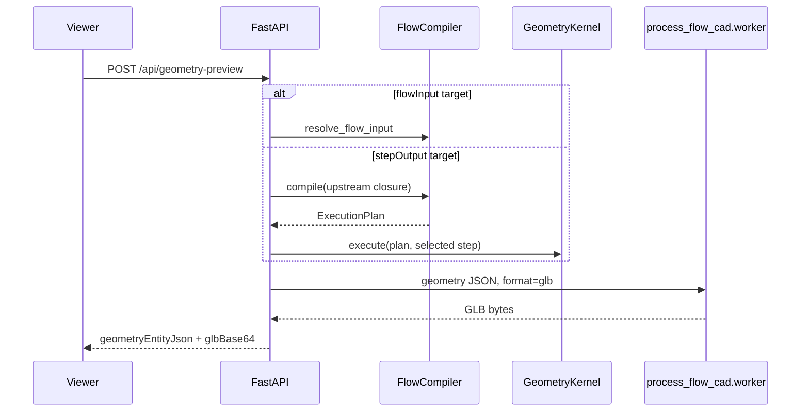

# Preview 與 export pipeline

Preview 與 file export 是兩條相關但不同的 runtime path。Preview 會 compile/execute 並同步產生 GLB；file export 使用 browser 已取得的 ready snapshot，不重新執行 flow。

## 同步 preview

`POST /api/geometry-preview` 接受：

- 一個 `flowInput` 或 `stepOutput` target；
- persisted `processFlowTemplateId` 與 inline draft `flowTemplate` 必須恰好提供一個；
- 共用的 `configuration`；
- optional `sourceLabel`。

Flow-input target 不執行 process modules。Step-output target 只 compile target upstream closure；不是 `GeometryKernel.execute_preview()`，目前沒有該 API。

GLB worker 由目前的 Python executable 以 `python -m process_flow_cad.worker` 啟動。
`GEOMETRY_PREVIEW_EXPORT_TIMEOUT_SECONDS`（default `30`）只控制同步 preview／STEP
conversion helper path。Timeout 時 API 會終止 worker 並回傳 error。

`POST /api/geometry-preview/step` 接受一份 `geometryStructure`，使用同一 worker 同步回傳 base64 STEP。

## 背景檔案 export

Viewer 可將同一份 ready snapshot 送到 `POST /api/geometry-preview/export-jobs`。Legacy alias
`POST /api/geometry-preview/cdb-jobs` 只建立 CDB job。

| 類型 | Input | 執行方式 |
| --- | --- | --- |
| `json` | `geometryEntityJson` | API process 直接寫 pretty JSON |
| `step` | `geometryStructure` | `process_flow_cad.worker step` subprocess |
| `cdb` | `geometryStructure` + positive `elementSize` | `process_flow_mesher.worker` subprocess |

Job state transition 是 `queued → running → success/failed`，取消路徑可經
`canceling → canceled`。Manager 預設同時執行一個 job；`EXPORT_MAX_CONCURRENT_JOBS`
優先於 legacy `CDB_EXPORT_MAX_CONCURRENT_JOBS`。每個 `clientId` 最多保留 20 個
terminal jobs。

Job list/get/cancel 以 browser-generated `clientId` filter。這是 UI isolation，不是 authentication；知道 client id 的 caller 可讀取或取消該 client jobs。

## 檔案寫入行為

Output path 必須是 absolute path、parent directory 必須已存在，extension 必須符合 kind。
Worker 先寫同一 directory 的 job temp file；成功時以 replace move 到 final path。若 final
path 已存在，job 開始時會先刪除。因此 caller 必須把 endpoint 視為 server-side file
write/replace capability。

Input temp files 會在 terminal state cleanup。Cleanup 失敗以 job `warning` 回報。

## Timeout、重啟與取消

背景 STEP/CDB jobs 目前沒有 hard timeout；`GEOMETRY_PREVIEW_EXPORT_TIMEOUT_SECONDS` 不適用。
取消 running subprocess 時會呼叫 terminate，但不提供 cross-process durable recovery。

Jobs、queue 與 history 都在 API process memory：

- restart 後 job history 消失；
- shutdown 會取消 queued jobs 並 terminate running jobs；
- 不應把此 manager 當 durable queue。

## Export 語意

CAD worker normalize structure 後支援 Box、Polygon、Cylinder、Cone。GLB 只包含 materialized body solids；STEP AP242 另包含 feature envelope solids。CDB 使用 2.5D mesher，其 primitive 與 feature semantics 較窄，詳見 [geometry-semantics.md](../concepts/geometry-semantics.md)。

## 失敗契約

Worker non-zero exit、missing output 或 conversion error 會轉成 API/job message；stderr 優先且
只保留尾端。同步 preview error 是 HTTP error；背景 error 保存在 job status。Operator 應記錄
API logs 與 job payload，因 job history 不會 persistence。
