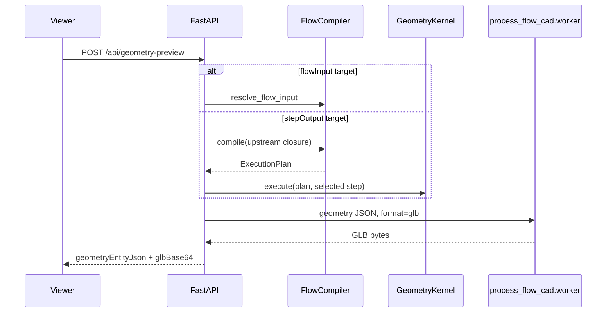
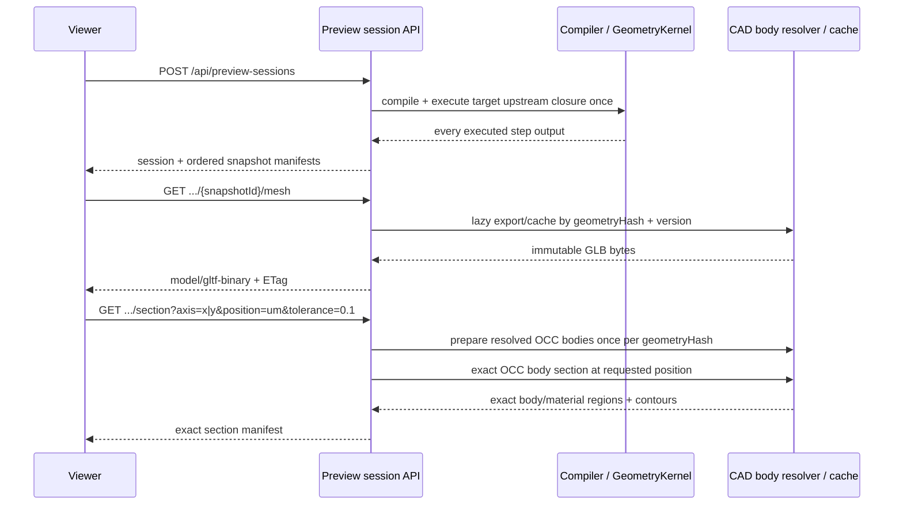

# Preview 與 export pipeline

Preview 與 file export 是兩條相關但不同的 runtime path。Legacy direct preview會compile/execute並同步
產生一份base64 GLB；current Geometry Preview UI改用semantic session。File export使用browser目前選取的
ready snapshot，不重新執行flow。

[ADR-0004](./decisions/0004-semantic-preview-sessions.md) 已核准semantic preview session、upstream
snapshots、content-addressed binary mesh、OCC exact body section與Three.js demand renderer。Session path
已實作；legacy single-GLB path暫時保留供compatibility。剩餘差異見
[PV-001..PV-005](../conformance.md)。

## 現行同步 preview

`POST /api/geometry-preview` 接受：

- 一個 `flowInput` 或 `stepOutput` target；
- persisted `processFlowTemplateId` 與 inline draft `flowTemplate` 必須恰好提供一個；
- 共用的 `configuration`；
- optional `sourceLabel`。

Flow-input target 不執行 process modules。Step-output target 只 compile target upstream closure；不是 `GeometryKernel.execute_preview()`，目前沒有該 API。

GLB worker 由目前的 Python executable 以 `python -m process_flow_cad.worker` 啟動。
`GEOMETRY_PREVIEW_EXPORT_TIMEOUT_SECONDS`（default `30`）只控制同步 preview／STEP
conversion helper path。Timeout 時 API 會終止 worker 並回傳 error。

`POST /api/geometry-preview/step` 接受一份 `geometryStructure`，使用同一 worker 同步回傳 base64 STEP。

此 path 目前沒有 session、跨step asset reuse、body diff、binary mesh URL或section endpoint。Viewer
切換step會建立另一個request並重新load整份GLB。

## Semantic preview session

`POST /api/preview-sessions`沿用既有template/configuration/target validation。`stepOutput` target只執行
target upstream closure一次，session manifest保存每個已執行upstream step（含target）的snapshot；
`flowInput` target只保存resolved input snapshot。相同semantic request以content-derived `sessionId`在
bounded LRU中coalesce/reuse；切換snapshot不會再次compile/execute。

Endpoints：

| Endpoint | Contract |
| --- | --- |
| `POST /api/preview-sessions` | 建立／reuse ephemeral session與ordered upstream snapshot manifests。 |
| `GET /api/preview-sessions/{sessionId}/snapshots/{snapshotId}/mesh` | Lazy傳回以geometryHash/version cache的binary GLB；支援ETag/304。 |
| `GET /api/preview-sessions/{sessionId}/snapshots/{snapshotId}/section` | 依`axis=x\|y`、finite position與positive tolerance回傳OCC body regions；支援ETag/304。 |

每個snapshot包含`geometryHash`、`geometryEntityJson`、`meshUrl`與`sectionUrl`。Mesh cache key是
`geometryHash + mesh cache version`；session/snapshot ids另包含request/contract version。Session JSON不
inline base64 mesh。Mesh與section response使用`private, max-age=31536000, immutable`及content-derived
ETag；section strong ETag包含`snapshotId`，因此相同geometry的不同snapshot response不會共用validator。
Client送`If-None-Match`時可取得`304`。

Session是interaction resource，不是durable job或committed instance。Session、mesh與section都使用
entry/byte bounded process-memory LRU，並coalesce相同in-flight work；server restart或eviction後asset URL
會回`404`，client以原request重新POST session。Resolved OCC prepared model另使用entry-bounded LRU；同一
`geometryHash`的不同position reuse同一model，不再重做normalize、primitive conversion、overlap
validation、same-material union或parent/child subtraction。同一prepared model的section calls會序列化，
不同geometry仍可在global build concurrency範圍內平行執行。

Cache、execution與admission設定：

| Environment variable | Default | Responsibility |
| --- | ---: | --- |
| `PREVIEW_SESSION_CACHE_ENTRIES` / `PREVIEW_SESSION_CACHE_BYTES` | `16` / `134217728` | Session manifest LRU bounds。 |
| `PREVIEW_MESH_CACHE_ENTRIES` / `PREVIEW_MESH_CACHE_BYTES` | `64` / `268435456` | Binary GLB LRU bounds。 |
| `PREVIEW_SECTION_CACHE_ENTRIES` / `PREVIEW_SECTION_CACHE_BYTES` | `256` / `67108864` | Position-specific section JSON LRU bounds。 |
| `PREVIEW_PREPARED_SECTION_CACHE_ENTRIES` | `16` | Opaque resolved OCC model entry bound。 |
| `PREVIEW_SESSION_BUILD_CONCURRENCY` | `2` | Concurrent compile/execute session builds。 |
| `PREVIEW_MESH_BUILD_CONCURRENCY` | `2` | Concurrent GLB subprocess builds。 |
| `PREVIEW_SECTION_BUILD_CONCURRENCY` | `2` | Concurrent OCC prepare/section work across geometries。 |
| `PREVIEW_SESSION_INFLIGHT_LIMIT` | `32` | Unique session single-flight registry bound。 |
| `PREVIEW_MESH_INFLIGHT_LIMIT` | `32` | Unique mesh single-flight registry bound。 |
| `PREVIEW_SECTION_INFLIGHT_LIMIT` | `64` | Unique position section registry bound。 |
| `PREVIEW_PREPARED_SECTION_INFLIGHT_LIMIT` | `16` | Unique OCC preparation registry bound。 |

相同key在capacity已滿時仍會join既有single-flight task；只有新的unique work會收到`503`與
`Retry-After: 1`。Python `asyncio.to_thread`無法強制中止已進入native CAD code的thread，因此client
cancel只取消等待；server以bounded registries及concurrency避免slider unique positions無限排隊。

### Exact section

Slider drag/debounce期間viewer先使用shader clipping，section card顯示`Computing`；140ms settle後請求
resolved CadBody shape的OpenCascade section。Response按body/material提供exact CAD area與closed 2D
`outer`/`holes` contours；viewer由同一response繪製3D caps、depth-tested material boundary outlines與
2D section。Curved contour polyline受request
tolerance控制。第一個query會prepare resolved bodies，後續position只建立section plane並對已保存的
shapes求交。Plane flip只改viewer保留哪一側，不改同一plane的section geometry。
Display clipping plane會依materialized model bounds使用小幅retained-side inset，cap offset再大於該
inset；因此requested plane上的既有tessellated cavity wall會被裁除，不會遮住exact cap。此epsilon只屬
display transform，不更動section request/response或CAD/export geometry，也不使用estimated feature bounds。
對極寬、極薄的package，2D engineering view可在presentation layer自動放大Z顯示比例並明示倍率；
此display transform不得回寫section response、影響CAD area或套用到3D geometry。

`PreviewSectionResponse.regions[]` 是strict contract：每個region包含`bodyId`、`sourceIds`、
`containerId/key`、`material`、`bodyKind`、nullable `featureType`、`approximationKind`、positive exact
`area`、closed `outer`與`holes`。每個2D point固定兩個finite numbers，loop至少四點且首尾相同；outer
逆時針、holes順時針。`containerKey`保留domain hierarchy value，root的合法empty key不得被response
validation拒絕。Current exact body section只產生`bodyKind: body`／`approximationKind: exact`，density
feature被排除。

Exact只修飾materialized body section。Via/circuit/bump仍是density envelope與estimated glyph/hatch，
不會因session或cap endpoint自動成為physical placement；UI必須標示`Estimated density`。

Viewer另依ADR-0005從snapshot GeometryStructure同步建立`EstimatedFeatureSectionLayer`。這個presentation
layer不進section response/cache key：plane與enabled feature envelope相交時，3D cross-section與2D SVG以
同一deterministic pattern model疊加；exact body loading/error不阻止estimated layer更新。

## 背景檔案 export

Viewer 可將同一份 ready snapshot 送到 `POST /api/geometry-preview/export-jobs`。Legacy alias
`POST /api/geometry-preview/cdb-jobs` 只建立 CDB job。

| 類型 | Input | 執行方式 |
| --- | --- | --- |
| `json` | `geometryEntityJson` | API process 直接寫 pretty JSON |
| `step` | `geometryStructure` | `process_flow_cad.worker step` subprocess |
| `cdb` | `geometryStructure` + positive `elementSize` | `process_flow_mesher.worker` subprocess |

Job state transition 是 `queued → running → success/failed`，取消路徑可經
`canceling → canceled`。Manager 預設同時執行一個 job；`EXPORT_MAX_CONCURRENT_JOBS`
優先於 legacy `CDB_EXPORT_MAX_CONCURRENT_JOBS`。每個 `clientId` 最多保留 20 個
terminal jobs。

Job list/get/cancel 以 browser-generated `clientId` filter。這是 UI isolation，不是 authentication；知道 client id 的 caller 可讀取或取消該 client jobs。

## 檔案寫入行為

Output path 必須是 absolute path、parent directory 必須已存在，extension 必須符合 kind。
Worker 先寫同一 directory 的 job temp file；成功時以 replace move 到 final path。若 final
path 已存在，job 開始時會先刪除。因此 caller 必須把 endpoint 視為 server-side file
write/replace capability。

Input temp files 會在 terminal state cleanup。Cleanup 失敗以 job `warning` 回報。

## Timeout、重啟與取消

背景 STEP/CDB jobs 目前沒有 hard timeout；`GEOMETRY_PREVIEW_EXPORT_TIMEOUT_SECONDS` 不適用。
取消 running subprocess 時會呼叫 terminate，但不提供 cross-process durable recovery。

Jobs、queue 與 history 都在 API process memory：

- restart 後 job history 消失；
- shutdown 會取消 queued jobs 並 terminate running jobs；
- 不應把此 manager 當 durable queue。

## Export 語意

CAD worker normalize structure 後支援 Box、Polygon、Cylinder、Cone。GLB 只包含 materialized body solids；STEP AP242 另包含 feature envelope solids。CDB 使用 2.5D mesher，其 primitive 與 feature semantics 較窄，詳見 [geometry-semantics.md](../concepts/geometry-semantics.md)。

Session display assets同樣只authoritative表示materialized bodies。Future display LOD不得改變body/material
identity；engineering section精度由BRep exact section path負責，不由display mesh triangle density決定。

## 失敗契約

Worker non-zero exit、missing output 或 conversion error 會轉成 API/job message；stderr 優先且
只保留尾端。同步 preview error 是 HTTP error；背景 error 保存在 job status。Operator 應記錄
API logs 與 job payload，因 job history 不會 persistence。

Session request的invalid output port回`400`；invalid section axis／non-positive tolerance由request
validation回`422`；missing／evicted session或unknown snapshot asset回`404`。Mesh/section conditional GET
命中ETag時回`304`且無body。Session/asset generation failure是HTTP error，不建立durable failure record。
