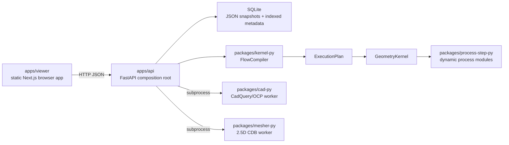

# 系統架構總覽

Process Flow 是 local-first PoC，由 static Next.js viewer、FastAPI/SQLite service、pure-Python process kernel，以及隔離的 CAD/mesher workers 組成。

## Container 視圖

## 套件職責

| 套件 | 負責 | 不負責 |
| --- | --- | --- |
| `apps/viewer` | Browser interaction、working editor state、HTTP clients、3D presentation | Canonical persistence、kernel execution rules |
| `apps/api` | HTTP contract、Pydantic validation、SQLite persistence/transactions、resource orchestration、export job lifecycle | Geometry domain operations |
| `packages/kernel-py` | Geometry domain、flow validation/compiler、execution plan、step execution、normalization | SQLite、HTTP、CadQuery、frontend state |
| `packages/process-step-py` | Concrete `execute(context)` operation modules | Persistence、API routing、module discovery policy |
| `packages/cad-py` | Geometry-to-CadQuery conversion、GLB、STEP AP242 | Flow compilation、catalog resolution |
| `packages/mesher-py` | Standard structure to 2.5D mesh/text CDB | Flow compilation、catalog resolution |

Dependency direction 是 `viewer → API → kernel`。API 另外啟動 CAD/mesher adapters；kernel
在 execution time 動態 import process-step modules；CAD 使用 kernel 的 normalization 與
polygon helpers。Kernel 不依賴 API 或 storage。

## 核心 runtime flow

### Resource CRUD 流程

FastAPI 的 strict Pydantic models 會拒絕 unknown fields。Service 驗證 domain constraints
後，`SQLiteStore` 把 canonical camelCase JSON 存入 `payload` column，並另外保存 list/query
metadata。現行 public API 對 process step、flow template、instance 與 geometry 採
insert-only；workspace 是可修改的例外。

### Compile 與 execute

1. API 從 SQLite 載入 instance、flow template 與被引用的 step templates。
2. `StoreGeometryCatalog` 把 SQLite geometry lookup 轉接成 kernel 的
   `GeometryCatalogResolver`。
3. `FlowCompiler` 驗證 topology/configuration、解析 catalog 或 embedded geometry、normalize
   structures，並建立有順序的 `ExecutionPlan`。
4. `GeometryKernel` 解析每個 planned input、clone geometry state、配置 material instance
   name，並 import `process_flow_steps.<program>`。
5. Module `execute(context)` 回傳或修改 `ProcessGeometryState`。
6. Kernel serialize selected output 與 step outputs，最後由 API 回傳 JSON。

### Workspace commit

Workspace create/update 使用 incomplete validation 與 optimistic `revision`。Commit 先執行
complete compile，再於單一 SQLite write transaction 中 materialize embedded geometries、
建立 immutable instance 並標記 workspace committed。

### Preview 與 export

Preview 可以直接解析 flow input，或只執行 step output 的 upstream closure。API 接著啟動
短生命週期的 CAD worker 產生 GLB。背景 JSON/STEP/CDB export job 使用已 ready 的 snapshot，
不重新 compile。完整行為與操作限制見
[Preview 與 export pipeline](./preview-export-pipeline.md)。

## Persistence 與生命週期

預設 storage 是 `apps/api/.data/process-flow.sqlite3`。啟動時 store 建立 tables、檢查
`schema_metadata.databaseSchemaVersion`，且只在所有 resource tables 都是空的時候 seed
fixtures。Internal marker 缺少或不等於 `"2"` 時，local database 會被清空並重新 seed；
此 PoC 不提供早期草案資料轉換。

Export job 是 process-local memory state，不是 SQLite resource。API shutdown 會取消 queued／
running jobs；restart 後 history 會消失。

## 部署邊界

Viewer 使用 `output: "export"`；`NEXT_PUBLIC_PROCESS_FLOW_API_BASE_URL` 會在 build time 寫入
browser JavaScript。API CORS 必須包含 static host origin。

現行 service 沒有 authentication 或 authorization。`POST /api/reset` 具有破壞性，export
endpoints 可寫入／取代 server-side absolute path，而 `clientId` 只做 list isolation，不是
security identity。這些 endpoints 只適合受信任的 local environment；對外部署前必須另做
security design。
