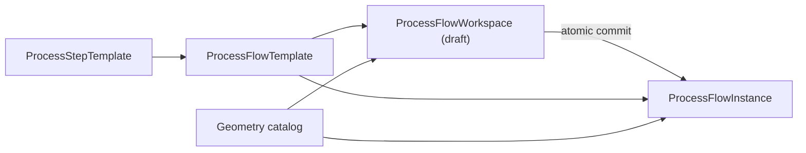

# Process Flow 產品模型

Process Flow 把「可重用的製程定義」、「研究中的配置」與「已保存的產品配置」分開管理。
這個分離是目前實作的核心，不應由 UI 畫面或 SQLite table 形狀反向定義。

## 角色與資源

| 資源 | 用途 | 可變性 | 主要 owner |
| --- | --- | --- | --- |
| `ProcessStepTemplate` | 定義一個 process operation 的 geometry ports、parameters 與 `program` | 建立後 immutable | Process developer |
| `ProcessFlowTemplate` | 定義 flow inputs、step references 與 directed topology | 建立後 immutable | Process developer |
| `ProcessFlowWorkspace` | 保存未完成的 geometry bindings 與 parameter values | Draft 可修改；以 `revision` optimistic concurrency 控制 | Product / RD engineer |
| `ProcessFlowInstance` | 保存完整且可執行的產品配置 | Immutable | Product / RD engineer |
| `GeometryEntity` | Catalog 中可被 flow input 引用的 geometry document | 建立後 immutable | Geometry producer |

`ProcessFlowTemplate` 只定義 topology，不保存產品 geometry selection 或 recipe value。`ProcessFlowInstance` 與 `ProcessFlowWorkspace` reference template，並以 `inputBindings` 與 `stepConfigurations` 提供 configuration。

## 生命週期

### Template 編輯

Flow template 的 step reference 綁定既有 step template。Topology 的執行順序由 `flowEdges` 推導，而不是由 `stepRefs` array order 決定。建立 template 前，API 會解析所有 referenced step templates 並驗證 graph。

### Workspace 研究流程

Workspace 可以 incomplete；Save Draft 只要求已提供的值與 reference 形狀正確。更新必須帶目前 `revision`，stale revision 會得到 conflict。Committed workspace 是 read-only。

Workspace 可使用 catalog binding 或 embedded binding。Embedded geometry 是 draft-local resource，尚不是 catalog entity。

### Commit 流程

Commit 會先以 complete mode compile workspace，再在同一個 SQLite transaction 中：

1. 把被引用的 embedded geometries materialize 成 immutable catalog geometries。
2. 把 embedded bindings 改寫成 catalog bindings。
3. 建立新的 immutable `ProcessFlowInstance`。
4. 將 workspace 標記為 `committed` 並記錄 `committedInstanceId`。

重試已完成的 commit 會回傳同一個 instance；`committedInstanceId` 是 retry safety，不代表 instance lineage。

## Compile 與 execute 邊界

`FlowCompiler` 是 external resource 與 executable plan 的邊界。它負責 graph/configuration validation、catalog/embedded geometry resolution、normalization，以及 preview target 的 upstream closure。輸出是完整的 `ExecutionPlan`。

`GeometryKernel` 只接收 `ExecutionPlan`，不查 SQLite、不解析 catalog id。它依 topological order 執行 process modules，並回傳 selected geometry、每個 step output 與 terminal step ids。

## 範圍

目前已有 workspace create/load/update/commit、template/instance create、execute、preview 與 export。Instance overwrite、instance lineage、workspace topology editing 與 draft list UI 不是目前產品契約。

欄位、invariants 與 JSON examples 的唯一 canonical prose specification 是 [data-model.md](../data-model.md)。本頁只定義產品心智模型與 ownership。
