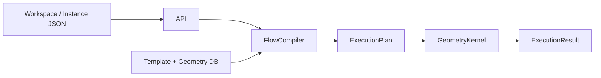

# Process Flow V2 Data Model

本文件是 process flow persistence、API、compiler、kernel 與 viewer 的 V2
資料模型規範。V2 是 breaking design；系統不讀取或轉換 V1 payload。

## 1. 設計原則

1. Geometry dataflow 與 process parameters 分離。
2. Template 定義結構，workspace 保存研究中的 mutable configuration，instance
   保存已確認且 immutable 的完整 configuration。
3. Geometry 只經由 typed ports 傳遞，不是 parameter value type。
4. Persisted object 使用 stable id；空字串、特殊 sentinel id 或 id prefix 不承擔
   source type 語意。
5. Compiler 負責 DB resolution 與 validation；kernel 只執行完整 execution plan。
6. Template、instance 與 catalog geometry 都是 immutable snapshots。

所有 V2 persisted payload 都包含：

```json
{ "schemaVersion": 2 }
```

## 2. Ownership

| Model | Owns | Does not own |
| --- | --- | --- |
| `ProcessStepTemplate` | Geometry ports、parameter definitions、process program | Parameter values、geometry records、flow topology |
| `ProcessFlowTemplate` | Flow inputs、step references、edges | Product values、geometry bindings |
| `ProcessFlowWorkspace` | Mutable bindings、parameter values、embedded geometry | Topology |
| `ProcessFlowInstance` | Complete immutable product configuration | Embedded geometry、topology、instance lineage |
| `GeometryEntity` | Immutable catalog metadata 與 complete geometry structure | Flow-specific role |
| `ExecutionPlan` | Fully resolved geometry structures、ordered steps、input routing | Repository handles、DB ids that still require lookup |

V2 沒有獨立的 `ProcessFlowTemplateRevision` model。每個 template id 代表一個
immutable snapshot；新版本使用新的 id 與 `version`。Workspace 的 `revision` 只用於
optimistic concurrency，不是 template revision。

## 3. ProcessStepTemplate

```json
{
  "schemaVersion": 2,
  "id": "step_tpl_pnp_2_0_0",
  "version": "V2.0.0",
  "name": "PnP",
  "category": "assembly.pnp",
  "program": "pnp/pnp",
  "description": "Places component geometry.",
  "owner": "integration.platform",
  "inputPorts": [
    {
      "portId": "main_geometry",
      "name": "Main geometry",
      "dataType": "geometry",
      "role": "primary",
      "required": true
    },
    {
      "portId": "die_geometry",
      "name": "Die geometry",
      "dataType": "geometry",
      "role": "auxiliary",
      "required": true
    }
  ],
  "outputPorts": [
    {
      "portId": "result_geometry",
      "name": "Result geometry",
      "dataType": "geometry"
    }
  ],
  "parameterDefinitions": [
    {
      "id": "coordinates",
      "name": "Coordinates",
      "valueType": "coordinates",
      "controlType": "coordinateList",
      "required": true,
      "unit": "um"
    }
  ]
}
```

### 3.1 Port invariants

- 必須有且只能有一個 primary input：`main_geometry`。
- `main_geometry.required` 必須為 `true`。
- 必須有且只能有一個 output：`result_geometry`。
- 其他 input port 使用 `role: "auxiliary"`。
- 本版所有 ports 的 `dataType` 都是 `geometry`。
- `inputPorts[].portId` 與 `outputPorts[].portId` 各自在 collection 內唯一。

Process module 從 `ProcessStepContext.geometry_inputs` 取得 ports。便利屬性
`input_geometry` 指向 `main_geometry`。

### 3.2 ParameterDefinition

支援的 `valueType`：

```text
string, integer, float, boolean, materialRef, coordinates,
string[], integer[], float[], materialRef[], fieldGroupArray
```

支援的 `controlType`：

```text
text, number, checkbox, select, repeater, coordinateList
```

`ParameterDefinition` 可包含：

- `required`
- `unit`
- `selectionMode`
- static `optionSource`
- string / numeric `validation`
- `repeatDefinition`

Geometry 不在這個 value type union 中。

### 3.3 Repeatable values

```json
{
  "layers": {
    "items": [
      {
        "itemId": "layer-1",
        "index": 1,
        "values": {
          "Dielectric": "PI",
          "Conductivity": "Cu",
          "thk": 2
        }
      }
    ]
  }
}
```

- Definition path 是 `repeatDefinition.itemParameterDefinitions[]`。
- Value path 是 `items[].values`。
- `itemId` 在同一 group 內唯一且保存於 workspace / instance。
- `index` 是 display index，不作為 identity。
- Nested repeat definitions 使用相同結構遞迴處理。

## 4. ProcessFlowTemplate

```json
{
  "schemaVersion": 2,
  "id": "flow_tpl_cowosl_2_0_0",
  "name": "CoWoS-L",
  "version": "V2.0.0",
  "description": "Reusable technology topology.",
  "owner": "integration.platform",
  "flowInputs": [
    {
      "flowInputId": "incoming_panel",
      "name": "Incoming panel",
      "dataType": "geometry",
      "required": true,
      "geometryConstraints": {
        "entityTypes": ["panel"],
        "categories": ["carrier.panel"],
        "structureFormats": ["standard"]
      }
    }
  ],
  "stepRefs": [
    {
      "stepRefId": "pnp",
      "stepLabel": "PnP",
      "processStepTemplateId": "step_tpl_pnp_2_0_0"
    }
  ],
  "flowEdges": [
    {
      "edgeId": "edge_panel_to_pnp",
      "source": {
        "kind": "flowInput",
        "flowInputId": "incoming_panel"
      },
      "target": {
        "stepRefId": "pnp",
        "inputPortId": "main_geometry"
      }
    }
  ]
}
```

Edge source union：

```json
{ "kind": "flowInput", "flowInputId": "incoming_panel" }
```

```json
{
  "kind": "stepOutput",
  "stepRefId": "pnp",
  "outputPortId": "result_geometry"
}
```

### 4.1 Topology invariants

- `flowInputId`、`stepRefId`、`edgeId` 各自在 flow template 內唯一。
- 每個 declared flow input 至少有一條 outgoing edge。
- 每個 required step input port 剛好有一條 incoming edge。
- Optional step input port 可以有零或一條 incoming edge。
- Edge source 與 target port 的 `dataType` 必須相同。
- Step output 不可連回自己，graph 不可有 cycle。
- 本版每個 step output port 最多一個 consumer；未來放寬 fan-out 時不需改 payload。
- Flow input 可以 fan-out 到多個 step ports。

### 4.2 Optional flow inputs

`FlowInputDefinition.required: false` 只有在它連到的 ports 都是 optional 時才可省略
binding。若其中任何 target port 為 required，該 flow input 的 binding 仍是 execution
required。Compiler 與 viewer 使用相同規則。

### 4.3 Unsaved preview draft

Template Editor 可把尚未保存的 topology inline 傳給 preview API。此時 template
`id` 可以是空字串，因為 compiler 不使用 persistence identity；flow input、step ref、
port 與 edge identifiers 仍須符合 topology invariants。正式建立
`ProcessFlowTemplate` 時 `id` 仍必須是非空且唯一。

## 5. Shared FlowConfiguration

Workspace、preview 與 compiler input 共用：

```json
{
  "inputBindings": {
    "incoming_panel": {
      "kind": "catalog",
      "geometryId": "panel_v1_0_0"
    }
  },
  "stepConfigurations": {
    "pnp": {
      "parameterValues": {
        "coordinates": [[0, 0]]
      }
    }
  },
  "embeddedGeometries": {}
}
```

`stepConfigurations` 以 `stepRefId` keyed。它不重複
`processStepTemplateId`，因為這個 binding 由 template 擁有。

Geometry binding 是 discriminated union：

```json
{ "kind": "catalog", "geometryId": "panel_v1_0_0" }
```

```json
{ "kind": "embedded", "localId": "draft_panel_1" }
```

## 6. ProcessFlowWorkspace

```json
{
  "schemaVersion": 2,
  "id": "workspace_123",
  "name": "Customer package study",
  "processFlowTemplateId": "flow_tpl_cowosl_2_0_0",
  "revision": 3,
  "status": "draft",
  "createdAt": "2026-07-10T10:00:00Z",
  "updatedAt": "2026-07-10T10:12:00Z",
  "inputBindings": {},
  "stepConfigurations": {},
  "embeddedGeometries": {}
}
```

Workspace 只 reference 一個已存在的 immutable template，因此不保存 `stepRefs` 或
`flowEdges`。它可以不完整：

- required binding 可以尚未選擇。
- required parameter 可以不存在或為空。
- Repeater item 可以存在但 child values 尚未完成。
- 已提供的 key、binding shape、parameter type 與 nested structure 仍必須合法。

Update request 必須帶目前 `revision`。成功後 revision 加一；stale update 回傳
`409 Conflict`。Committed workspace read-only。

## 7. ProcessFlowInstance

```json
{
  "schemaVersion": 2,
  "id": "flow_inst_customer_a",
  "name": "Customer A",
  "processFlowTemplateId": "flow_tpl_cowosl_2_0_0",
  "inputBindings": {
    "incoming_panel": {
      "kind": "catalog",
      "geometryId": "panel_v1_0_0"
    }
  },
  "stepConfigurations": {}
}
```

Instance 必須 complete，且所有 bindings 都是 catalog bindings。API 沒有 instance
update endpoint。建立另一個產品或新 study result 時產生新的 instance id。

## 8. Workspace Commit

Commit 是單一 SQLite transaction：

1. 驗證 workspace revision 與 `status: draft`。
2. 以 complete mode compile workspace。
3. 只 materialize 被 binding reference 的 embedded geometries。
4. 將 embedded bindings 改寫成 catalog bindings。
5. Insert 新 immutable `ProcessFlowInstance`。
6. 將 workspace 標記 `committed`、revision 加一並保存
   `committedInstanceId`。

Committed workspace 自身也保存改寫後的 catalog bindings，並清空
`embeddedGeometries`。`committedInstanceId` 只提供 retry idempotency，不表示 instance
lineage。重送 commit 回傳第一次建立的 instance。

## 9. Compile and Execute Boundary



Compiler：

- resolve step templates；
- validate topology 與 configuration；
- resolve catalog / embedded geometries；
- normalize external structures；
- select preview upstream closure；
- 產生 ordered `PlannedStep[]` 與 explicit geometry input sources。

Kernel：

- 不持有 repository；
- 不接受 geometry DB id；
- 不查 template / instance；
- clone upstream state、執行 process modules、收集 outputs。

## 10. Persistence

同一個 SQLite database 包含：

```text
process_step_templates
process_flow_templates
process_flow_instances
process_flow_workspaces
geometries
schema_metadata
```

`schema_metadata.databaseSchemaVersion` 目前是 `2`。因本產品尚未 release，啟動時若
偵測到 unversioned 或非 V2 local database，resource tables 會清空並由 V2 fixtures
重建；不執行 V1 payload migration。
