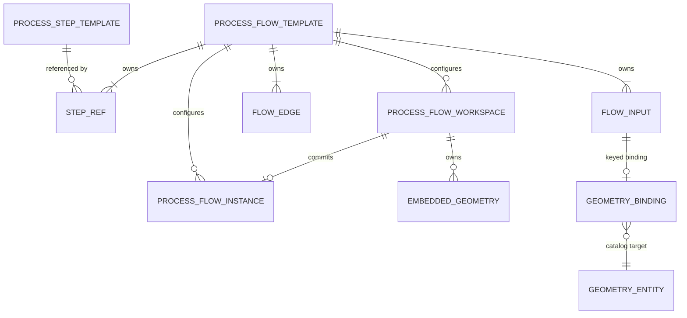
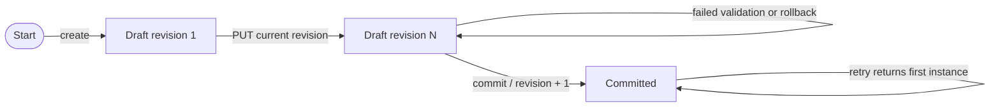
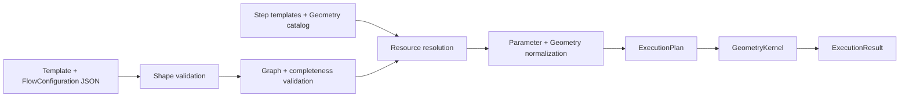

# Process Flow 資料模型

本文件是 Process Flow 唯一的 normative data contract，涵蓋 persistence、API、
compiler、kernel 與 viewer 共同使用的 resource、reference、lifecycle 與 validation
語義。若其他說明文件、fixture 或現行程式碼與本文件衝突，以本文件定義的 target
contract 為準；尚未對齊的行為列在[已知實作差異](#15-已知實作差異)。

本文使用下列規範詞：

- **MUST / MUST NOT**：符合本 contract 的實作必須遵守。
- **SHOULD / SHOULD NOT**：除非有記錄明確理由，否則應遵守。
- **MAY**：可選行為。

詳細子規範：

- [Parameter Schema](./reference/parameter-schema.md)
- [Geometry Entity and Structure](./reference/geometry-structure.md)
- [Persistence](./reference/persistence.md)
- [ADR-0002：Single-terminal Flow](./architecture/decisions/0002-single-terminal-flow.md)
- [ADR-0003：Geometry Units and Density](./architecture/decisions/0003-geometry-units-and-density.md)

## 1. 範圍與非目標

本文件只定義目前唯一的資料模型。`geometryRef`、`StepValueSet`、`fieldDefinitions` 與
`templateFamilyId` 是未採用的早期草案欄位，MUST NOT 出現在 request 或 persisted
resource；系統不定義這些草案欄位的轉換路徑。需要另一份 immutable template snapshot
時，建立新的 resource id。

本文件不定義：

- 個別 process program 的幾何演算法；
- CAD、STEP、GLB 或 CDB 格式；
- UI layout、visual token 或 interaction；
- material catalog。`materialRef` 是 opaque material key，不表示系統已存在
  material database。

## 2. 固定格式標記與 resource metadata

下列欄位是現行程式使用的 wire-format marker、internal storage marker、resource label 或
concurrency token，**都不是產品正式版號**。目前只支援本文件描述的一種 contract，不提供
version negotiation 或依版號分支的行為。

| 用途 | Field | Type | Current value | Meaning |
| --- | --- | --- | --- | --- |
| Process resource wire marker | `schemaVersion` | integer | `2` | Implementation-reserved fixed literal；不代表第二個產品版本。 |
| Geometry structure format marker | `GeometryEntity.structure.schemaVersion` | string | `"1.0.0"` | Container tree 與 geometry primitives 的固定格式識別。 |
| SQLite internal schema marker | `schema_metadata.databaseSchemaVersion` | string | `"2"` | Startup 用來確認目前 physical tables 的內部值，不是 public release。 |
| Resource metadata label | `version` | string | `"current"` for new resources | Opaque display/source label；未正式發行前 MUST 是 `current`，不得解析、排序、推導行為差異或由 resource id 推導。 |
| Workspace concurrency token | `revision` | integer | `>= 1` | Optimistic concurrency token；不代表 template 或產品版本。 |

`GeometryEntity` 外層不是 Process resource schema，因此不包含 numeric
`schemaVersion: 2`；其 nested `structure` MUST 包含 geometry format marker。

### 2.1 Field table 語意

除非特別標示 request variant，本文 field table 的 `Required` 指 **canonical persisted／
response payload 必須存在**。若同一列有 `Default`，create/draft request MAY 省略該欄，
validator 必須 materialize default；canonical payload 仍 MUST 明確輸出。`Default: none` 且
`Required: yes` 表示 request 必須提供。Nullable 與 optional 是不同概念；只有 type 明列
`null` 的欄位才可傳 `null`。

## 3. 核心設計原則

1. Geometry dataflow 與 process parameter values MUST 分離。
2. `ProcessFlowTemplate` 定義 topology；`ProcessFlowWorkspace` 保存 mutable study；
   `ProcessFlowInstance` 保存 complete immutable product configuration。
3. Geometry 只經由 typed ports 與 `inputBindings` 傳遞，不是 parameter value type。
4. Template、instance 與 catalog geometry 是 immutable snapshots。Immutable 表示不可
   in-place update；是否允許 delete 由 persistence policy 另行規定。
5. Compiler 負責 cross-resource resolution、graph validation、configuration validation
   與 execution-plan construction；kernel 不查 repository。
6. Resource reference MUST 使用 stable persisted id。空字串、id prefix 或 sentinel value
   MUST NOT 承擔 source type 語義；union MUST 使用明確 discriminator。
7. 每個 valid flow MUST 有且只能有一個 terminal step。
8. Canonical geometry unit MUST 是 `um`；feature density MUST 是 inclusive `0..100`。

## 4. 概念模型



| Model | Owns | Does not own | Mutability |
| --- | --- | --- | --- |
| `ProcessStepTemplate` | Geometry ports、parameter definitions、process program locator | Parameter values、geometry records、flow topology | Immutable snapshot |
| `ProcessFlowTemplate` | Flow inputs、step refs、edges | Product values、geometry bindings | Immutable snapshot |
| `ProcessFlowWorkspace` | Mutable bindings、parameter values、embedded geometries、commit state | Topology | Mutable only while `draft` |
| `ProcessFlowInstance` | Complete product configuration | Embedded geometries、topology、instance lineage | Immutable snapshot |
| `GeometryEntity` | Catalog metadata 與 complete `GeometryStructure` | Flow-specific role | Immutable snapshot |
| `ExecutionPlan` | Resolved structures、ordered steps、explicit input routing | Repository handle 或 unresolved repository id | Runtime-only；dataclass envelope frozen，nested mappings MUST 視為 read-only |

目前模型沒有 `ProcessFlowTemplateRevision` 或 `templateFamilyId`。每個 template id 代表
一份 snapshot；另一份 snapshot MUST 使用新的 `id`。正式發行策略確立前，新 resource 的
opaque `version` label MUST 使用 `current`。Consumer MUST NOT parse/sort 該 label，或從
id prefix 推導 model kind／release generation。

## 5. 識別碼、引用與 canonical JSON

### 5.1 Process Flow 識別碼格式

下列 Process Flow identifiers MUST 符合：

```text
^[A-Za-z][A-Za-z0-9_.-]*$
```

適用範圍：resource `id`、`portId`、`ParameterDefinition.id`、`flowInputId`、
`stepRefId`、`edgeId`、embedded `localId` 與 repeat `itemId`。GeometryStructure 內部
衍生的 `container:*` / `body:*` ids 屬於另一個 namespace，不受此 regex 限制。

| Identifier | Uniqueness scope |
| --- | --- |
| Resource `id` | 同一 resource table 內唯一；不同 resource families 不保證 global uniqueness。 |
| `portId` | `inputPorts` 或 `outputPorts` collection 內唯一。 |
| `ParameterDefinition.id` | 同一 parameter collection 內唯一；nested repeat collection 重新計算 scope。 |
| `flowInputId`、`stepRefId`、`edgeId` | 同一 `ProcessFlowTemplate` 內各自唯一。 |
| Embedded `localId` | 同一 `FlowConfiguration.embeddedGeometries` map 內唯一。 |
| Repeat `itemId` | 同一 repeat group value 內唯一。 |

### 5.2 Map key 引用

- `inputBindings` 的 key MUST 是該 template 的 `flowInputId`。
- `stepConfigurations` 的 key MUST 是該 template 的 `stepRefId`。
- Embedded binding 的 `localId` MUST 對應同一 configuration 的
  `embeddedGeometries` key。
- Catalog binding 的 `geometryId` MUST 對應 persisted `GeometryEntity.id`。
- Unknown keys MUST 被拒絕；未被任何 binding reference 的 embedded geometry MAY 存在於
  draft，但 commit MUST 丟棄，不得 materialize。

### 5.3 `null` 與省略規則

Canonical persisted JSON SHOULD 省略 optional `null` 欄位；空字串不是 `null` 的替代。
若 API response 的用途是下載未保存 preview，`GeometryEntity.id` 等欄位 MAY 明確為
`null`。Consumers MUST NOT 依賴 object key order。

## 6. ProcessStepTemplate

`ProcessStepTemplate` 定義一個可執行 process node 的 ports、parameters 與 module path。

| Field | Type | Required | Default | Contract |
| --- | --- | --- | --- | --- |
| `schemaVersion` | integer literal | yes | `2` | MUST equal `2`。 |
| `id` | identifier | yes | none | Immutable snapshot identity。 |
| `version` | non-empty string | yes | none | Opaque metadata label；未正式發行前 MUST 是 `current`，不得 parse、sort 或驅動行為。 |
| `name` | non-empty string | yes | none | Human-facing name。 |
| `category` | non-empty string | yes | none | Dot-delimited category MAY 表達 hierarchy。 |
| `program` | string | yes | none | Extensionless relative module path under `process_flow_steps`；每個 segment MUST match `[A-Za-z0-9_-]+`。 |
| `description` | string | no | `""` | Human-facing description。 |
| `owner` | non-empty string | yes | none | Owning team or domain。 |
| `inputPorts` | `GeometryInputPort[]` | yes | none | MUST 包含 exactly one primary port。 |
| `outputPorts` | `GeometryOutputPort[]` | yes | none | MUST 是 exactly one `result_geometry`。 |
| `parameterDefinitions` | `ParameterDefinition[]` | yes | none | 詳見 Parameter Schema。 |

### 6.1 Port 規則

| Field | Input port | Output port |
| --- | --- | --- |
| Identity | `portId` | `portId` |
| Data type | literal `"geometry"` | literal `"geometry"` |
| Display | non-empty `name`、optional `description` | non-empty `name`、optional `description` |
| Requiredness | `required`, default `true` | not applicable |
| Role | `primary` or `auxiliary` | not applicable |

Port invariants：

- MUST 有且只能有一個 `role: "primary"` 的 input，且其 id MUST 是
  `main_geometry`、`required` MUST 是 `true`。
- 其他 input ports MUST 使用 `role: "auxiliary"`。
- MUST 有且只能有一個 output，id MUST 是 `result_geometry`。
- 本版所有 ports 的 `dataType` MUST 是 `geometry`。
- Process module 以 `ProcessStepContext.state` 操作 primary geometry，並以
  `require_geometry(portId)` 取得 auxiliary geometry。

### 6.2 Parameter 規則

Geometry MUST NOT 出現在 parameter value union。`controlType` 是 rendering contract，
`valueType` 與 validation 才是 data contract；但 static `optionSource` 另有 enum 語義，
提供時 values MUST 屬於 options。完整規則見
[Parameter Schema](./reference/parameter-schema.md)。

`workingTemp` 已棄用，新建 template MUST NOT 宣告此 parameter，UI 與 compiler 也
MUST NOT 自動補入。若 process program 確實需要溫度，必須定義語意明確的 domain-specific
parameter（例如 `bondingTemperature`），不得沿用已棄用的 `workingTemp` id。

## 7. ProcessFlowTemplate

`ProcessFlowTemplate` 是 reusable technology topology，不保存 geometry selection 或
parameter values。

| Field | Type | Required | Default | Contract |
| --- | --- | --- | --- | --- |
| `schemaVersion` | integer literal | yes | `2` | MUST equal `2`。 |
| `id` | identifier | persisted: yes; preview draft: no | draft `""` | Persisted template id MUST non-empty。 |
| `name` | non-empty string | yes | none | Human-facing name。 |
| `version` | non-empty string | yes | none | Opaque metadata label；未正式發行前 MUST 是 `current`，不得 parse、sort 或驅動行為。 |
| `description` | string | no | `""` | Description。 |
| `owner` | non-empty string | persisted: yes | draft MAY be `""` | Owning team。 |
| `flowInputs` | `FlowInputDefinition[]` | yes | none | MUST 至少一個。 |
| `stepRefs` | `StepRef[]` | yes | none | MUST 至少一個。 |
| `flowEdges` | `FlowEdge[]` | yes | none | Typed routing。 |

### 7.1 FlowInputDefinition

| Field | Type | Required | Default | Contract |
| --- | --- | --- | --- | --- |
| `flowInputId` | identifier | yes | none | Template-local identity。 |
| `name` | non-empty string | yes | none | Display name。 |
| `description` | string | no | `""` | Description。 |
| `dataType` | literal `"geometry"` | yes | `"geometry"` | Must match target port。 |
| `required` | boolean | yes | `true` | See composite requiredness below。 |
| `geometryConstraints` | object | no | none | Optional entity/category/format filters。 |

`GeometryConstraints` fields：

| Field | Type | Required | Default | Contract |
| --- | --- | --- | --- | --- |
| `entityTypes` | non-empty string array | no | omitted | Exact case-sensitive envelope types；empty array 等同不限制。 |
| `categories` | non-empty string array | no | omitted | Exact 或 dot-delimited descendant categories；empty array 等同不限制。 |
| `structureFormats` | non-empty string array | no | omitted | Exact case-sensitive formats；目前唯一 supported value 是 `standard`。 |

Geometry constraint matching：

- `entityTypes`：case-sensitive exact match。
- `categories`：case-sensitive exact match，或 dot-delimited descendant match；例如
  `die` 接受 `die.hbm`，但不接受 `dielectric`。
- `structureFormats`：case-sensitive exact match。
- Empty or omitted constraint list 表示不限制該維度。

### 7.2 StepRef 與 FlowEdge

`StepRef`：

| Field | Type | Required | Default | Contract |
| --- | --- | --- | --- | --- |
| `stepRefId` | identifier | yes | none | Flow-local identity。 |
| `stepLabel` | string or `null` | no | omitted | Optional display override；empty/`null` 都表示使用 step-template name。 |
| `processStepTemplateId` | identifier | yes | none | Existing immutable step-template reference。 |

`FlowEdge`：

| Field | Type | Required | Default | Contract |
| --- | --- | --- | --- | --- |
| `edgeId` | identifier | yes | none | Flow-local identity。 |
| `source` | `FlowInputEdgeSource \| StepOutputEdgeSource` | yes | none | Discriminator 是 `kind`。 |
| `target` | `FlowEdgeTarget` | yes | none | Exactly one target step input。 |

| Object | Fields | Contract |
| --- | --- | --- |
| `FlowInputEdgeSource` | `kind: "flowInput"`、required `flowInputId` | References one declared flow input。 |
| `StepOutputEdgeSource` | `kind: "stepOutput"`、required `stepRefId`、required `outputPortId` | `outputPortId` MUST 是 `result_geometry`。 |
| `FlowEdgeTarget` | required `stepRefId`、required `inputPortId` | References one declared target port。 |

```json
{
  "stepRefId": "pnp",
  "stepLabel": "PnP",
  "processStepTemplateId": "step_tpl_pnp"
}
```

Edge source 是 discriminated union：

```json
{ "kind": "flowInput", "flowInputId": "incoming_panel" }
```

```json
{
  "kind": "stepOutput",
  "stepRefId": "pnp",
  "outputPortId": "result_geometry"
}
```

Edge target：

```json
{ "stepRefId": "pnp", "inputPortId": "main_geometry" }
```

### 7.3 Topology 不變條件

- 每個 declared flow input MUST 至少有一條 outgoing edge。
- 每個 required step input port MUST 剛好有一條 incoming edge。
- Optional input port MAY 有零或一條 incoming edge。
- Edge source 與 target `dataType` MUST 相同。
- Step output MUST NOT 連回同一 step，graph MUST acyclic。
- 每個 step output port 最多一個 consumer；flow input MAY fan-out。
- 所有 `stepRefs` MUST 位於同一個 connected execution graph，且 MUST 收斂至 exactly
  one terminal step。Terminal step 是其 `result_geometry` 沒有 outgoing edge 的 step。
- Flow-level execution output MUST 是唯一 terminal step 的 `result_geometry`。Array order
  MUST NOT 用來選 output。

完整決策見 [ADR-0002](./architecture/decisions/0002-single-terminal-flow.md)。

### 7.4 Optional flow input 規則

Binding requirement 是 flow input 與其實際 consumers 的 composite rule：

- `FlowInputDefinition.required: true`：binding MUST 存在。
- `required: false` 且所有相關 target ports 都 optional：binding MAY 省略。
- 任一相關 target port required：binding MUST 存在。
- Partial preview 只計算 target upstream closure 內的 consumers。
- 若 optional binding 有提供，它仍 MUST resolve 並符合 constraints。

### 7.5 未儲存的 preview draft

Inline preview MAY 使用 `ProcessFlowTemplateDraft`，其 `id` MAY 是空字串；所有
flow input、step、port 與 edge ids 仍 MUST 合法。Persisted create MUST 使用非空唯一 id。

## 8. 共用 `FlowConfiguration`

Workspace、preview 與 compiler input 共用 `FlowConfiguration`：

| Field | Type | Required | Default | Contract |
| --- | --- | --- | --- | --- |
| `inputBindings` | map of `flowInputId -> GeometryBinding` | canonical yes | `{}` | Unknown flow-input key MUST reject。 |
| `stepConfigurations` | map of `stepRefId -> StepConfiguration` | canonical yes | `{}` | Unknown step key MUST reject。 |
| `embeddedGeometries` | map of `localId -> EmbeddedGeometry` | configuration canonical yes | `{}` | Instance MUST NOT persist this field。 |

Geometry binding：

```json
{ "kind": "catalog", "geometryId": "panel_v1_0_0" }
```

```json
{ "kind": "embedded", "localId": "draft_panel_1" }
```

| Binding kind | Required fields | Forbidden fields |
| --- | --- | --- |
| `catalog` | `kind: "catalog"`、non-empty `geometryId` | `localId` |
| `embedded` | `kind: "embedded"`、non-empty `localId` | `geometryId` |

`StepConfiguration` 只有一個 canonical field：`parameterValues` 是 parameter-id keyed object，
request MAY 省略並 default 為 `{}`。Unknown top-level fields 與 unknown parameter ids MUST
reject；value shape 由對應 `ParameterDefinition` 決定。

`stepConfigurations` 以 `stepRefId` keyed，MUST NOT 重複
`processStepTemplateId`；template owns 該 binding。

```json
{
  "pnp": {
    "parameterValues": {
      "coordinates": [[0, 0]]
    }
  }
}
```

## 9. ProcessFlowWorkspace

Workspace reference exactly one immutable flow template，並保存可不完整的 study state。

| Field | Type | Required | Contract |
| --- | --- | --- | --- |
| `schemaVersion` | integer literal `2` | persisted yes | Process resource schema。 |
| `id` | identifier | yes | Server-generated immutable id。 |
| `name` | non-empty string | yes | Mutable while draft。 |
| `processFlowTemplateId` | identifier | yes | Immutable reference。 |
| `revision` | integer `>= 1` | yes | Optimistic concurrency token。 |
| `status` | `draft \| committed` | yes | Lifecycle state。 |
| `committedInstanceId` | identifier | committed only | First successful commit result。 |
| `createdAt` | RFC 3339 UTC string | yes | Immutable timestamp。 |
| `updatedAt` | RFC 3339 UTC string | yes | Update/commit timestamp。 |
| FlowConfiguration fields | objects | yes | Mutable only while draft。 |

Draft MAY 缺少 required binding/parameter，或保存 incomplete repeat item；但已提供的
key、union shape、non-empty parameter type、max/range constraints 與 local references MUST
合法。Catalog existence、geometry constraints 與 full completeness MAY 延後至 preview 或
commit，詳見 validation matrix。

Workspace update 使用 full-replacement `PUT` semantics：request MUST 帶目前
`revision` 與完整 desired `inputBindings`、`stepConfigurations`、
`embeddedGeometries`；省略 map 等同清空。成功後 revision 加一；stale update MUST 回
`409 Conflict`。Committed workspace read-only。

### 9.1 生命週期



Commit retry 以 workspace 的 committed state 為準。一旦 commit 成功，後續 retry MUST
回傳第一次建立的 workspace/instance，即使 retry request 提供不同 revision、instance id
或 name；不得建立第二份 instance。

## 10. ProcessFlowInstance

Instance 是 complete、immutable、catalog-only product configuration。

| Field | Type | Required | Contract |
| --- | --- | --- | --- |
| `schemaVersion` | integer literal `2` | yes | Process resource schema。 |
| `id` | identifier | yes | Client-selected immutable identity，table-local unique。 |
| `name` | non-empty string | yes | Immutable display name。 |
| `processFlowTemplateId` | identifier | yes | Existing immutable template。 |
| `inputBindings` | map of catalog bindings | yes | Embedded binding MUST NOT appear；optional inputs MAY be absent。 |
| `stepConfigurations` | map | yes | Required values complete；steps without values MAY be absent。 |

API MUST NOT provide in-place instance update。新產品、study result 或 recipe change MUST
建立新的 instance id。目前模型不保存 instance lineage、source workspace、created timestamp 或
revision；`committedInstanceId` 是 workspace retry pointer，不是 lineage relation。

## 11. Workspace commit transaction

Commit 可以先讀取 workspace snapshot 並在 transaction 外做 complete compile，避免把
昂貴的 resource resolution 與 geometry hydration 放進長 transaction；所有 persistence
writes 則 MUST 位於同一個 SQLite transaction。Write transaction 必須：

1. Re-read workspace；若已 committed，直接回傳第一次建立的 result。
2. 重新驗證 request revision、`status: draft`，並確認被 compile 的 snapshot 仍是同一
   revision。
3. 只 materialize 被 binding reference 的 embedded geometries；同一 `localId` 被多次
   reference 時只建立一個 catalog entity。
4. 將 embedded bindings 改寫成 catalog bindings。
5. Insert new immutable `ProcessFlowInstance`。
6. 將 workspace 標記 `committed`、revision 加一、保存 `committedInstanceId`，改寫
   bindings 並清空 `embeddedGeometries`。

任何 transaction 內的 duplicate id 或 persistence failure MUST rollback geometry、instance
與 workspace update。Transaction 外的 validation、resolution 或 compile failure MUST 在
任何 write 前結束。Retry after failure MAY 使用同一 request 再試。

## 12. 驗證矩陣

| Boundary | Shape / extra fields | Graph | Parameter values | Resource existence / constraints | Geometry deep validity | Process module load |
| --- | --- | --- | --- | --- | --- | --- |
| Step template create | complete | port invariants | definition schema + option enum definition | n/a | n/a | SHOULD validate program locator |
| Flow template create | complete | complete，含 exactly one terminal | definitions resolved | step templates MUST exist | n/a | not executed |
| Workspace create / update | complete | referenced template already valid | missing/empty required allowed；provided values validate | Catalog existence MAY defer；embedded local ref MUST exist | MAY defer | not executed |
| Flow-input preview | complete | full template valid | unrelated steps MAY be incomplete | target binding MUST resolve/match | target geometry MUST hydrate | not executed |
| Step-output preview | complete | full template valid | target upstream closure MUST complete | closure bindings MUST resolve/match | closure geometries MUST hydrate | closure modules MUST load/execute |
| Instance create | complete | referenced template valid | full flow MUST complete | all supplied bindings MUST resolve/match | all used geometries MUST hydrate | SHOULD be loadable；execution errors remain possible only for domain behavior |
| Workspace commit | complete | referenced template valid | full flow MUST complete | all used bindings MUST resolve/match | all used geometries MUST hydrate | SHOULD be loadable before persistence |
| Execute | stored resource is revalidated | complete | complete | resolve again | required | required and executed |
| Seed/import | MUST pass same validators as create | required | required by resource type | required where applicable | required | SHOULD verify program locator |

「Complete」只表示本表中對應 boundary 的所有 required checks 已通過，不應以單一模糊
boolean 取代 validation stage 或 error details。

## 13. Compile 與 execute 邊界



Compiler MUST：

- resolve step templates；
- validate topology、exactly one terminal 與 target closure；
- validate bindings、parameter types、enum options 與 completeness；
- resolve catalog/embedded geometries，確認 `unitSystem: "um"` 與 constraints；
- hydrate/normalize external structures；
- normalize persisted parameter values into runtime values；
- produce ordered `PlannedStep[]` 與 explicit geometry-input sources。

Kernel MUST：

- receive only `ExecutionPlan`，never repository；
- never resolve DB ids；
- clone upstream state before mutation；
- apply material-instance rewriting to normalized `materialRef` values；
- execute process modules in topological order；
- return all step outputs plus the unique terminal output。

`ExecutionPlan` MAY retain resolved template metadata ids for diagnostics/context；「沒有 DB id」
表示沒有仍需 repository lookup 的 id。

## 14. 可完整執行的 PnP golden example

以下三個 documents 是同一個完整 target-contract example。它使用現有 catalog fixtures
`panel_v1_0_0` 與 `hbm_v1_3_1`；若 catalog records 存在，即可 compile 並執行
`pnp/pnp`。`workingTemp` 刻意不出現，因為該 id 已棄用，且 PnP 不需要溫度 input。
這些既有 fixture id 是 opaque identity；其中的數字尾碼不表示產品版本，也不能用來
選擇 schema 或切換行為。

### 14.1 ProcessStepTemplate

```json
{
  "schemaVersion": 2,
  "id": "step_tpl_pnp_golden",
  "version": "current",
  "name": "PnP",
  "category": "assembly.pnp",
  "program": "pnp/pnp",
  "description": "Places copies of an auxiliary die geometry on the primary geometry.",
  "owner": "integration.platform",
  "inputPorts": [
    {
      "portId": "main_geometry",
      "name": "Main geometry",
      "dataType": "geometry",
      "role": "primary",
      "required": true
    },
    {
      "portId": "die_geometry",
      "name": "Die geometry",
      "dataType": "geometry",
      "role": "auxiliary",
      "required": true
    }
  ],
  "outputPorts": [
    {
      "portId": "result_geometry",
      "name": "Result geometry",
      "dataType": "geometry"
    }
  ],
  "parameterDefinitions": [
    {
      "id": "coordinates",
      "name": "Coordinates",
      "description": "Bottom-left placement coordinates for each die copy.",
      "valueType": "coordinates",
      "controlType": "coordinateList",
      "required": true,
      "unit": "um"
    }
  ]
}
```

### 14.2 ProcessFlowTemplate

```json
{
  "schemaVersion": 2,
  "id": "flow_tpl_pnp_golden",
  "name": "PnP Golden Flow",
  "version": "current",
  "description": "Single-terminal PnP reference flow.",
  "owner": "integration.platform",
  "flowInputs": [
    {
      "flowInputId": "incoming_panel",
      "name": "Incoming panel",
      "dataType": "geometry",
      "required": true,
      "geometryConstraints": {
        "entityTypes": ["panel"],
        "categories": ["carrier.panel"],
        "structureFormats": ["standard"]
      }
    },
    {
      "flowInputId": "incoming_die",
      "name": "Incoming die",
      "dataType": "geometry",
      "required": true,
      "geometryConstraints": {
        "entityTypes": ["die"],
        "categories": ["die.hbm"],
        "structureFormats": ["standard"]
      }
    }
  ],
  "stepRefs": [
    {
      "stepRefId": "pnp",
      "stepLabel": "Place HBM",
      "processStepTemplateId": "step_tpl_pnp_golden"
    }
  ],
  "flowEdges": [
    {
      "edgeId": "edge_panel_to_pnp_main",
      "source": {
        "kind": "flowInput",
        "flowInputId": "incoming_panel"
      },
      "target": {
        "stepRefId": "pnp",
        "inputPortId": "main_geometry"
      }
    },
    {
      "edgeId": "edge_die_to_pnp_aux",
      "source": {
        "kind": "flowInput",
        "flowInputId": "incoming_die"
      },
      "target": {
        "stepRefId": "pnp",
        "inputPortId": "die_geometry"
      }
    }
  ]
}
```

### 14.3 ProcessFlowInstance

```json
{
  "schemaVersion": 2,
  "id": "flow_inst_pnp_golden",
  "name": "PnP Golden Instance",
  "processFlowTemplateId": "flow_tpl_pnp_golden",
  "inputBindings": {
    "incoming_panel": {
      "kind": "catalog",
      "geometryId": "panel_v1_0_0"
    },
    "incoming_die": {
      "kind": "catalog",
      "geometryId": "hbm_v1_3_1"
    }
  },
  "stepConfigurations": {
    "pnp": {
      "parameterValues": {
        "coordinates": [
          [-760, -520],
          [760, -520]
        ]
      }
    }
  }
}
```

此 graph 的唯一 terminal 是 `pnp.result_geometry`；兩個 required ports 各有 exactly one
source；兩個 required bindings 與 `coordinates` 都完整。

## 15. 已知實作差異

所有 current/target/status 只在 [Target contract 實作對照](./conformance.md) 維護；核心
範圍是 `DM-001` 至 `DM-020`。本節不複製 table，避免同一 gap 在多處產生不同狀態。

任何修改 target contract 的提案 MUST 先新增或更新 ADR，再同步本文件、reference、
conformance ledger、machine-readable schema（建立後）與 contract tests。
