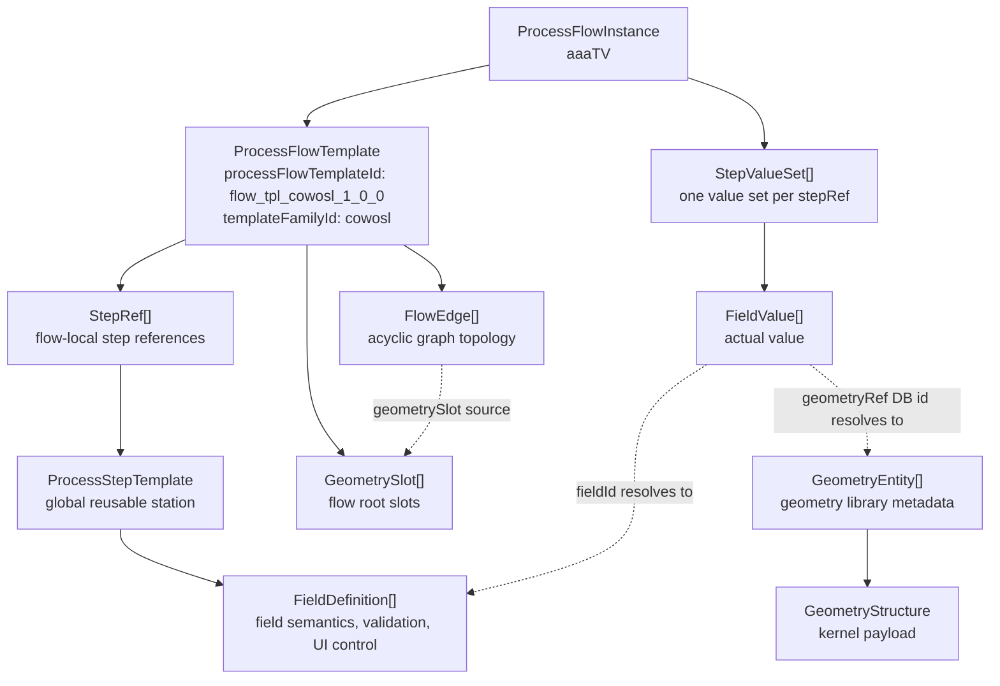

# Process Flow Data Model Overview

## 1. What This Document Explains

這份文件描述 process flow PoC 的核心資料概念，以及 template 與 instance 之間的分工。

讀這份文件時，可以先抓住一個主軸：template 定義「一種封裝技術流程可以填什麼、怎麼串接、如何驗證」；instance 保存「某個 TV/Product 實際使用哪些 geometry DB id、實際填了哪些 value」。

V1 不把 geometry 當成自動產生 FEM-ready model 的工具。這裡提到的 `geometryRef` 是 `FieldValue` 的一種 value type；payload 是 geometry database 中的 immutable `GeometryEntity.id`，或在有上游 step output edge 時使用 `null` 表示由 graph resolve。

本文件中的資料範例統一使用 JSON；後續 schema、mock data 與 API payload 也以 JSON 作為主要開發格式。

## 2. Glossary

| Term | Meaning | Scope |
|---|---|---|
| `ProcessStepTemplate` | 可重複使用的 process station 定義，例如 molding、underfill、die attach | Global |
| `FieldDefinition` | 某個 station 可以填寫的欄位定義，例如 `mold_thickness`、`mold_material` | Belongs to `ProcessStepTemplate` |
| `ProcessFlowTemplate` | 某個封裝技術平台的流程快照，保存 geometry slots、站點引用與 graph topology | Global immutable snapshot |
| `StepRef` | 某條 flow 裡的一個 station node，引用一個 global `ProcessStepTemplate` | Flow-local |
| `GeometrySlot` | Flow template 定義的 geometry input category 與流程入口，例如 `wafer.glass` | Flow-local |
| `FlowEdge` | Geometry slot、station output、station input 之間的有向連接 | Flow-local |
| `ProcessFlowInstance` | 某個 TV/Product 依照特定 flow template 建立的產品資料 | Product-specific |
| `StepValueSet` | 某個 instance 對某個 `StepRef` 填寫的一組 station values | Product-specific |
| `FieldValue` | 某個 instance 對某個 `FieldDefinition` 填寫的實際 value | Product-specific |

最容易混淆的是 `ProcessStepTemplate`、`StepRef`、`StepValueSet`：

- `ProcessStepTemplate` 是全域可共用的站點定義。
- `StepRef` 是某條 flow 裡使用該站點的一個節點。
- `StepValueSet` 是某個 TV/Product 對該節點填入的實際資料。

## 3. Core Mental Model

可以用三層來理解整體資料模型：

| Layer | Object | 負責保存 | 不保存 |
|---|---|---|---|
| Station definition | `ProcessStepTemplate` | 單一 process station 的欄位定義、輸入方式、驗證規則 | 特定 TV/Product 的實際值 |
| Flow definition | `ProcessFlowTemplate` | geometry categories、站點引用、graph topology | 特定 TV/Product 的實際 geometry id 或 field value |
| Product data | `ProcessFlowInstance` | 某個 TV/Product 的 geometryRef field value 與一般 field value | template definition |

核心原則是：definition objects 描述「可以填什麼與如何驗證」，instance objects 保存「某個 TV/Product 實際使用哪些 geometry DB id、實際填了哪些 value」。

## 4. Lifecycle: From Template to Product Instance

以 `aaaTV` 使用 `cowosl v1.0.0` 為例：

1. Integration/platform owner 建立全域 `ProcessStepTemplate`，例如 `Molding / Encapsulation`。它代表一個可重複使用的 process station。
2. `ProcessStepTemplate.fieldDefinitions[]` 直接內嵌多個 `FieldDefinition`，例如 `mold_material`、`mold_thickness`、`post_mold_stack_thickness`。`FieldDefinition` 只描述欄位語意、value type、UI control、validation 或 reference，不保存任何產品實際值。
3. Flow owner 建立 `ProcessFlowTemplate`，例如 `flow_tpl_cowosl_1_0_0`。Flow template 不複製欄位、不填 value；它用 `geometrySlots[]` 定義 flow roots 需要哪些 geometry category，用 `stepRefs[]` 表示需要哪些已經建立 process step template，並用 `flowEdges[]` 決定 graph topology。
4. Engineer 建立並編輯 `ProcessFlowInstance`，例如 `aaaTV` instance。Instance 建立階段會先完成初始綁定與資料骨架，後續再在同一個 instance 裡填入 station values：
   - 鎖定 `processFlowTemplateId`，讓 instance 永遠追溯到建立時選定的 flow template。
   - 在 `StepValueSet.fieldValues[]` 中保存 `geometryRef` 欄位的 geometry DB id；若 value 為 `null`，表示該欄位由上游 step output edge resolve。
   - 依據綁定 flow template resolve `stepRefs[]` 與 `flowEdges[]`，並建立對應的 `StepValueSet[]`。每個 `StepValueSet` 紀錄 flow 中對應 process step `stepRefId` 與所需要參數 。

## 5. Data Model Relationship



關係讀法：

- `ProcessStepTemplate -> FieldDefinition`：定義單一 station 有哪些欄位，以及每個欄位如何輸入與驗證。
- `ProcessFlowTemplate -> GeometrySlot`：定義 process graph 的 geometry input category 與流程入口。Template 不保存某個 TV/Product 實際選到的 geometry object。
- `ProcessFlowTemplate -> StepRef -> ProcessStepTemplate`：定義 package technology graph 由哪些 station nodes 組成。`StepRef.stepRefId` 是 flow-local stable id，不是 global process step template id。
- `ProcessFlowTemplate -> FlowEdge`：定義 geometry slots、step outputs 與 target step input slots 之間的有向連接關係。Flow graph 必須 acyclic。
- `ProcessFlowInstance -> StepValueSet -> FieldValue`：保存某個 TV/Product 在每個 station 的實際填值。
- `FieldValue -> FieldDefinition`：透過 `fieldId` 回到欄位定義，決定 value shape、validation、reference 與 UI 行為。
- `FieldValue -> GeometryEntity -> GeometryStructure`：`valueType: "geometryRef"` 的 field value 保存 geometry DB id string，或保存可由上游 `stepOutput` edge resolve 的 `null`。

## 6. Versioning and Governance Rules

這一節的核心規則是：template 是 immutable snapshot；identity 用來追溯精確版本；instance 永遠綁定建立時選定的 flow template，不會因新版 template 出現而被靜默改寫。

### 6.1 Identity and Version Labels

| Field | Scope | Meaning |
|---|---|---|
| `processStepTemplateId` | Global | 單一 process station definition snapshot 的唯一 id。 |
| `processFlowTemplateId` | Global | 單一 process flow template snapshot 的唯一 id。 |
| `templateFamilyId` | Flow template family | 表示同一個流程家族，例如 `cowosl`。同一家族的不同版本會有不同 `processFlowTemplateId`，但共享相同 `templateFamilyId`。 |
| `version` | Human-readable label | 給人閱讀的版本標籤，例如 `1.0.0` 或 `2.0.0`；不取代 template id 作為資料關聯。 |
| `ProcessFlowInstance.processFlowTemplateId` | Product instance | Instance 建立時選定的 immutable binding，建立後不得直接修改。 |

```json
{
  "templateFamilyId": "cowosl",
  "processFlowTemplates": [
    {
      "processFlowTemplateId": "flow_tpl_cowosl_1_0_0",
      "version": "1.0.0"
    },
    {
      "processFlowTemplateId": "flow_tpl_cowosl_2_0_0",
      "version": "2.0.0"
    }
  ]
}
```

### 6.2 Immutable Boundaries

- 所有processStepTemplate在建立後就不得修改，如果有新需求應該建立新的template
- 所有processFlowTemplate在建立後就不得修改，如果有新需求應該建立新的template

## 7. Minimal End-to-End Example

以下範例展示 `mold_thickness` 如何從 station 欄位定義，透過 flow template 成為 `aaaTV` instance 裡的一筆實際值。

```json
{
  "processStepTemplate": {
    "id": "step_tpl_molding_1_0_0",
    "name": "Molding / Encapsulation",
    "fieldDefinitions": [
      {
        "id": "main_geometry",
        "name": "main_geometry",
        "scope": "inputState",
        "valueType": "geometryRef",
        "controlType": null,
        "selectionMode": null,
        "unit": null
      },
      {
        "id": "mold_thickness",
        "name": "Mold thickness",
        "scope": "processParameter",
        "valueType": "float",
        "controlType": "number",
        "unit": "um",
        "validation": {
          "min": 0
        }
      }
    ]
  },
  "processFlowTemplate": {
    "id": "flow_tpl_cowosl_1_0_0",
    "templateFamilyId": "cowosl",
    "version": "1.0.0",
    "geometrySlots": [
      {
        "geometrySlotId": "incoming_wafer",
        "name": "Incoming wafer",
        "category": "wafer.glass",
        "required": true
      }
    ],
    "stepRefs": [
      {
        "stepRefId": "molding",
        "processStepTemplateId": "step_tpl_molding_1_0_0"
      }
    ],
    "flowEdges": [
      {
        "edgeId": "edge_incoming_wafer_to_molding",
        "from": {
          "sourceType": "geometrySlot",
          "geometrySlotId": "incoming_wafer"
        },
        "to": {
          "stepRefId": "molding",
          "targetFieldId": "main_geometry"
        }
      }
    ]
  },
  "processFlowInstance": {
    "processFlowInstanceId": "flow_inst_aaatv_001",
    "tvProductId": "aaaTV",
    "processFlowTemplateId": "flow_tpl_cowosl_1_0_0",
    "stepValueSets": [
      {
        "stepRefId": "molding",
        "fieldValues": [
          {
            "fieldId": "main_geometry",
            "value": "geom_wafer_aaatv_rev_a"
          },
          {
            "fieldId": "mold_thickness",
            "value": 420
          }
        ]
      }
    ]
  }
}
```
