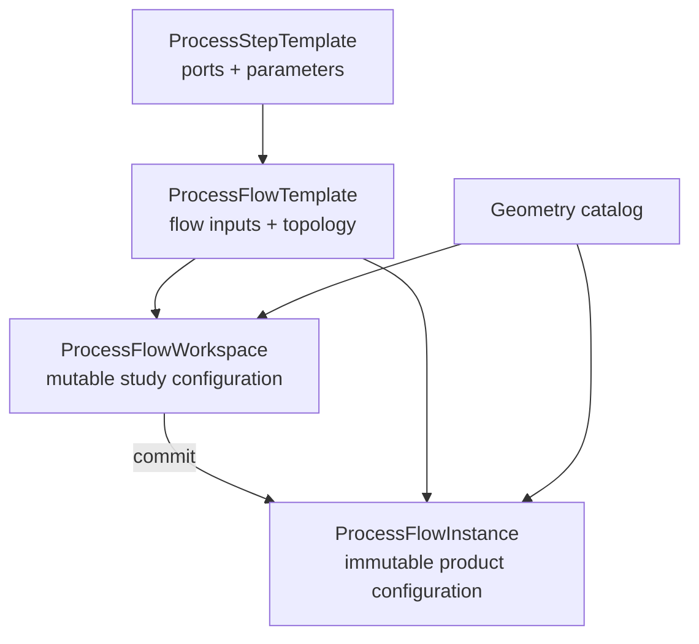
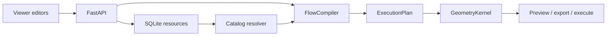

# Process Flow V2 Overview

## Product Model

這個系統同時支援兩種工作：

1. Process developer 建立可重用的 technology topology，例如 CoWoS-L。
2. Product / RD engineer 以既有 topology 進行 geometry 與 recipe study，最後保存
   immutable product instance。

V2 將這兩種工作拆成不同 ownership，避免 topology、研究中資料與正式 instance
互相污染。

## Core Concepts

### Process step as a typed processing node

每個 process step：

- 從 `inputPorts` 接收一個 primary geometry 與零或多個 auxiliary geometries；
- 從 `parameterDefinitions` 接收 recipe values；
- 從 `result_geometry` 輸出加工後 geometry。

Geometry 不再混在 parameter values 中。

### Flow template as topology

Flow template 定義：

- 外部 geometry interface：`flowInputs`；
- process nodes：`stepRefs`；
- interface、step outputs 與 step input ports 的連接：`flowEdges`。

它不保存 geometry selection 或 parameter values。

### Workspace as mutable research state

Workspace reference 一個既有 immutable template，並保存：

- `inputBindings`；
- `stepConfigurations`；
- 未來 geometry tools 產生的 `embeddedGeometries`。

Workspace 可以 incomplete，使用 manual Save Draft 與 optimistic revision。這版 UI
不提供 draft list 或從 instance clone；已知 workspace 可由 URL 直接 reload。

### Instance as immutable result

Commit 將 workspace 轉成完整 instance。Embedded geometry 先 materialize 到 catalog，
因此 instance 只包含 catalog binding。Instance 沒有 overwrite 行為。

## Runtime Architecture

### API layer

- Owns persistence and transactions.
- Loads immutable templates and catalog geometry.
- Saves incomplete workspace payloads.
- Performs atomic workspace commit.

### Compiler layer

- Validates graph and configuration.
- Resolves catalog and embedded geometry.
- Produces full geometry structures and explicit step routing.
- Builds only the upstream closure required by a preview target.

### Kernel layer

- Receives only `ExecutionPlan`.
- Never queries DB or resolves ids.
- Executes process modules in topological order.
- Clones upstream output before a downstream step mutates it.

## Editors

| UI | Starting point | Topology | Persistence |
| --- | --- | --- | --- |
| Step Template Editor | New or clone existing step template | Ports and parameter schema editable | New immutable step template |
| Flow Template Editor | New flow or copy existing template | Editable until Save Template | Template-only or atomic template + instance |
| Flow Instance Workspace | Existing flow template | Read-only | Mutable draft, then immutable instance |

Flow Template Editor 保留一份 working configuration 供 preview 與 optional instance save。
Save Template 不會保存這些 values；儲存後 topology 鎖定，仍可補齊 configuration 並
Save Instance。

## Current Scope

已實作：

- V2 ports、flow inputs、edges 與 configuration；
- catalog / embedded resolver；
- execution plan boundary；
- workspace create、load、update、commit；
- template-only 與 template + instance save；
- catalog geometry picker、parameters、preview；
- V2-only database bootstrap。

保留於 backend、尚未出現在 UI：

- Embedded geometry binding 與 commit materialization。

不在本版：

- SOC / SOIC / HBM / wafer / panel geometry creation tools；
- draft list；
- topology-editable workspace；
- clone / overwrite existing instance；
- instance lineage。

完整 schema 與 invariants 見 [data-model.md](./data-model.md)。
