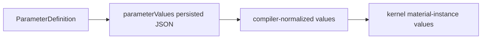

# Parameter Schema

本文件是 [Process Flow 資料模型](../data-model.md) 的 normative parameter
reference，定義 `ParameterDefinition`、persisted values、compiler normalization 與
kernel-visible runtime values。若本文與核心文件衝突，以核心文件為準。

## 1. 三層資料形狀

Parameter data MUST 區分三層：



| Layer | Owner | Shape |
| --- | --- | --- |
| Definition | `ProcessStepTemplate` | Type、UI control、enum options、validation、unit、repeat schema。 |
| Persisted value | Workspace / Instance | User-entered JSON，保留 repeat `itemId`、`index`、`values` wrapper。 |
| Compiler-normalized value | `ExecutionPlan.PlannedStep.parameter_values` | Numeric canonicalization、repeat flattening、missing optional value normalization。 |
| Kernel value | `ProcessStepContext.values` | Compiler values，再套用 `materialRef` instance naming。 |

`ProcessStepContext.raw_parameter_values` MUST 保留 persisted values；process modules
SHOULD 使用 `context.values` / `context.get_param()`，不得自行解析 persisted wrapper。

## 2. ParameterDefinition

`Required` / `Default` 欄位依核心資料模型的
[field table 語意](../data-model.md#21-field-table-語意)：有 default 的 create request MAY 省略，
canonical payload 必須使用 materialized value。

| Field | Type | Required | Default | Contract |
| --- | --- | --- | --- | --- |
| `id` | Process Flow identifier | yes | none | 同一 parameter collection 內唯一。 |
| `name` | non-empty string | yes | none | Human-facing label。 |
| `description` | string | no | `""` | Help text。 |
| `valueType` | `ValueType` | yes | none | Persisted/runtime semantic type。 |
| `controlType` | `ControlType` | target: yes | none | Deterministic renderer contract；MUST 是 `valueType` 的合法組合。 |
| `selectionMode` | `single \| multiple` | conditional | none | 使用 `optionSource` 時 MUST 明確提供：scalar 為 `single`、array 為 `multiple`；其他 control MUST omit。 |
| `required` | boolean | no | `true` | Completeness requirement。 |
| `unit` | string | no | none | Display/domain unit；不觸發 implicit conversion。 |
| `optionSource` | `OptionSource` | conditional | none | Static enum；values MUST belong to its options。 |
| `validation` | `ValidationRule` | no | none | Additional value constraints。 |
| `repeatDefinition` | `RepeatDefinition` | conditional | none | MUST exist only for `fieldGroupArray`。 |

Parameter ids、nested item parameter ids 與 repeat `itemId` MUST 符合：

```text
^[A-Za-z][A-Za-z0-9_.-]*$
```

## 3. ValueType

| `valueType` | Persisted JSON | Compiler-normalized value | Empty collection allowed |
| --- | --- | --- | --- |
| `string` | string | string | n/a |
| `integer` | finite JSON number with integral value | integer | n/a |
| `float` | finite JSON number | float | n/a |
| `boolean` | boolean | boolean | n/a |
| `materialRef` | non-empty string when present | string；kernel MAY rewrite suffix | n/a |
| `coordinates` | array of unique `[x, y]` pairs | array of float pairs | yes |
| `string[]` | string array | string array | yes |
| `integer[]` | integral finite number array | integer array | yes |
| `float[]` | finite number array | float array | yes |
| `materialRef[]` | non-empty string array items | string array；kernel MAY rewrite suffixes | yes |
| `fieldGroupArray` | repeat wrapper object | flat item object array | 由 `minItems` 決定 |

Rules：

- JSON boolean MUST NOT 被當成 integer 或 float。
- `integer` MAY 接受 `1.0`，但 normalized value MUST 是 `1`；非 integral number MUST reject。
- `float` MAY 接受 JSON integer，normalized value MUST 使用 numeric float semantics。
- NaN 與 positive/negative Infinity 不是合法 JSON/parameter number，MUST reject。
- Coordinates MUST 使用 exactly two finite numbers，MUST 依 numeric equality 去除歧義並
  reject duplicates；coordinates 代表 `[x, y]`，canonical length unit 是 `um`。
- Required collection 的 `[]` 是「已提供的空 collection」，不是 missing。若 domain
  至少需要一個 item，definition MUST 使用可表達 cardinality 的 schema；
  `fieldGroupArray` 使用 `minItems`。目前 generic arrays/coordinates 沒有 `minItems` field。

## 4. `ControlType` 合法組合

`controlType` 決定 viewer 的 deterministic rendering，但不得改變 value semantics。

| `valueType` | Allowed `controlType` |
| --- | --- |
| `coordinates` | `coordinateList` |
| `fieldGroupArray` | `repeater` |
| `boolean` | `checkbox` |
| `integer`, `float` | `number`, `select` |
| Scalar `string`, `materialRef` | `text`, `select` |
| Array types | `text`, `select`, `checkbox` |

Additional rules：

- `select` MUST 提供 non-empty `optionSource`。
- Non-boolean `checkbox` MUST 提供 `optionSource`；boolean checkbox MUST NOT 提供
  `optionSource`。
- Scalar option control MUST 使用 `selectionMode: "single"`。
- Array option control MUST 使用 `selectionMode: "multiple"`。
- 沒有 `optionSource` 的 control MUST 省略 `selectionMode`。
- `coordinateList` 與 `repeater` MUST NOT 提供 `optionSource`。

## 5. OptionSource 是 enum contract

目前 contract 只支援 static option source：

```json
{
  "type": "static",
  "options": [
    {
      "value": "Cu",
      "name": "Copper",
      "description": "Copper material key"
    }
  ]
}
```

| Field | Type | Required | Default | Contract |
| --- | --- | --- | --- | --- |
| `type` | literal `"static"` | canonical yes | `"static"` | Discriminator；request MAY omit。 |
| `options` | `StaticOption[]` | yes | none | MUST non-empty when required by control。 |
| `options[].value` | string or finite number | yes | none | MUST 符合 parameter scalar value type，且在同一 source 內唯一。 |
| `options[].name` | non-empty string | yes | none | Display label。 |
| `options[].description` | string | no | omitted | Help text。 |

Enum semantics：

- Scalar value MUST JSON-equal one `options[].value`。
- Array value 的每個 item MUST JSON-equal one option value。
- Unknown option MUST 在 draft 的 non-empty value validation 與 complete compile 被拒絕。
- Option order MAY 決定 UI display order，但 MUST NOT 改變 persisted value。
- `optionSource` 不是 suggestion list；需要自由輸入時使用 `text` / `number` 並省略
  `optionSource`。

## 6. ValidationRule

```json
{
  "min": 0,
  "max": 100,
  "exclusiveMin": false,
  "exclusiveMax": false
}
```

| Field | Applies to | Contract |
| --- | --- | --- |
| `regex` | `string`, `materialRef` and their arrays | Full-string match；pattern MUST compile。 |
| `minLength` | string-like values | Integer `>= 0`。 |
| `maxLength` | string-like values | Integer `>= minLength`。 |
| `min` | numeric values | Inclusive unless `exclusiveMin: true`。 |
| `max` | numeric values | Inclusive unless `exclusiveMax: true`。 |
| `exclusiveMin` | numeric values with `min` | Has no meaning without `min`。 |
| `exclusiveMax` | numeric values with `max` | Has no meaning without `max`。 |

For array value types，scalar rule MUST 套用到每個 item。目前 generic arrays 不提供 array
length validation；需要 structured cardinality 時使用 `fieldGroupArray`。

## 7. RepeatDefinition 與 persisted value

Definition：

```json
{
  "id": "layers",
  "name": "Layers",
  "valueType": "fieldGroupArray",
  "controlType": "repeater",
  "required": true,
  "repeatDefinition": {
    "itemNameTemplate": "RDL layer {{index}}",
    "indexBase": 1,
    "minItems": 1,
    "maxItems": 16,
    "itemParameterDefinitions": [
      {
        "id": "material",
        "name": "Material",
        "valueType": "materialRef",
        "controlType": "text",
        "required": true
      },
      {
        "id": "thk",
        "name": "Thickness",
        "valueType": "float",
        "controlType": "number",
        "required": true,
        "unit": "um",
        "validation": {
          "min": 0,
          "exclusiveMin": true
        }
      }
    ]
  }
}
```

| Repeat field | Type | Required | Default / rule |
| --- | --- | --- | --- |
| `itemNameTemplate` | string | yes | MAY contain `{{index}}` display placeholder。 |
| `indexBase` | integer | yes | First display index used by authoring UI。 |
| `minItems` | integer `>= 0` | no | `0`。Complete values MUST satisfy。 |
| `maxItems` | integer `>= 0` | no | unbounded；draft and complete values MUST satisfy。 |
| `itemParameterDefinitions` | `ParameterDefinition[]` | yes | Recursively applies this document。 |

Persisted value：

```json
{
  "layers": {
    "items": [
      {
        "itemId": "layer-1",
        "index": 1,
        "values": {
          "material": "PI",
          "thk": 2
        }
      }
    ]
  }
}
```

Repeat value invariants：

- Repeat wrapper MUST 只包含 `items`；unknown wrapper fields MUST reject。
- `items` MUST 是 array，array order 是 canonical execution order，compiler MUST 原樣保留。
- `itemId` MUST 合法、non-empty，且在同一 group 唯一；它是 identity。
- 每個 item MUST 只包含 `itemId`、`index`、`values`；unknown item fields MUST reject。
- `index` MUST 是 finite integer；它只用於 display，不是 identity，也不要求唯一。UI、compiler
  與 process module MUST NOT 依 `index` sort 或 reorder items。
- `values` MUST 是 object；unknown child parameter keys MUST reject。
- Nested `fieldGroupArray` 遞迴使用相同 shape。
- Draft MAY 保存 incomplete child values，但仍 MUST 符合 shape、id uniqueness 與
  `maxItems`。

Collection order 規則：

| Collection | Order semantics |
| --- | --- |
| `parameterDefinitions[]` / nested definitions | Authoring/display order；runtime 必須以 id 取值，不得依位置賦予 meaning。 |
| `optionSource.options[]` | UI display order；不改變 persisted enum value。 |
| `coordinates[]` | Placement execution 與 serialized child order。 |
| Repeat `items[]` | Process execution order；例如 RDL 奇偶層依 array position，不依 display `index`。 |

## 8. Compiler normalization

Persisted repeat wrapper 不直接傳給 process module。Compiler MUST 將上例 normalize 為：

```json
{
  "layers": [
    {
      "_itemId": "layer-1",
      "_index": 1,
      "material": "PI",
      "thk": 2.0
    }
  ]
}
```

Normalization rules：

- Unknown top-level parameter key MUST reject。
- Definition order MAY 決定 normalized object iteration order，但 modules MUST access by id。
- Repeat/coordinates array order MUST preserve；normalization MUST NOT sort。
- Missing optional parameter normalize 為 `null`；persisted JSON MAY omit it。
- Missing required parameter在 draft MAY 接受，在 complete compile MUST reject。
- `null` 與 `""` 對 required scalar 都是 incomplete。
- Numeric、array、coordinate 與 repeat values依本文件 canonicalize。
- Normalization MUST NOT mutate persisted `raw_parameter_values`。

## 9. `materialRef` runtime 語意

`materialRef` / `materialRef[]` 是 opaque、non-empty material keys；目前沒有 material
repository resolution requirement。Kernel MAY 為 birth/death grouping 對 normalized value
加 `_dup<number>` suffix：

- `Cu` 第一次使用保留 `Cu`；
- main geometry 已有 `Cu` 時，新 birth group MAY 使用 `Cu_dup2`；
- terminal `_dup<number>` 是 runtime instance suffix，不是 catalog identity；
- process module MUST 使用 `context.values`，MUST NOT 自行添加 suffix；
- `raw_parameter_values` 仍保留 user-entered material key。

## 10. Unit 與 workingTemp

- Length parameter values MUST 以 `um` 解讀；`unit: "um"` SHOULD 明確保存。
- Temperature parameter MAY 使用 `unit: "degC"`，但不屬於 GeometryStructure unitSystem。
- `unit` 是 contract metadata，不表示 compiler 會做 conversion。
- `workingTemp` 是 deprecated id，新建 template MUST NOT 宣告。若 domain behavior
  需要溫度，必須定義語意明確的新 parameter（例如 `bondingTemperature`），不得沿用
  `workingTemp`；UI、compiler 與 agent 也 MUST NOT 自動補入。

## 11. 驗證階段

| Stage | Missing required | Non-empty invalid type/range | Unknown option | `minItems` | `maxItems` |
| --- | --- | --- | --- | --- | --- |
| Draft save | allowed | reject | reject | MAY be below | reject if exceeded |
| Partial preview | target closure must complete | reject | reject | enforce in closure | enforce |
| Instance / commit | reject | reject | reject | enforce | enforce |
| Execute | reject on revalidation | reject | reject | enforce | enforce |

## 12. 已知實作差異

Parameter implementation gaps 的唯一追蹤來源是
[Target contract 實作對照](../conformance.md)：`DM-004`、`DM-005`、`DM-006`、`DM-009`
與 `DM-012`。Consumers 不得把 current 寬鬆行為當成擴充 contract。
