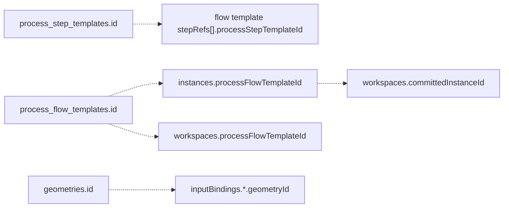

# Persistence

本文件是 [Process Flow 資料模型](../data-model.md) 的 normative persistence
reference，定義 SQLite physical storage、logical references、immutability、transactions、
internal schema marker 與未發行階段的 reset policy。

## 1. 儲存模型

Process Flow 使用單一 SQLite database。每個 resource table 保存：

1. Canonical camelCase JSON in `payload`；
2. 少量 denormalized columns，供 primary key、filter、sort 與 concurrency control；
3. indexes，不把完整 domain model正規化成多張 relational child tables。

`payload` 是 read response 的 domain source；denormalized columns MUST 與 payload 在同一
transaction 保持一致。Direct database edits 不屬於 supported API。

## 2. 實體 tables

### 2.1 `process_step_templates`

| Column | SQLite type | Constraint | Payload path |
| --- | --- | --- | --- |
| `id` | `TEXT` | primary key | `id` |
| `name` | `TEXT` | not null | `name` |
| `category` | `TEXT` | not null, indexed | `category` |
| `version` | `TEXT` | not null | `version` |
| `owner` | `TEXT` | not null | `owner` |
| `payload` | `TEXT` | not null | complete JSON |

### 2.2 `process_flow_templates`

| Column | SQLite type | Constraint | Payload path |
| --- | --- | --- | --- |
| `id` | `TEXT` | primary key | `id` |
| `name` | `TEXT` | not null | `name` |
| `version` | `TEXT` | not null | `version` |
| `owner` | `TEXT` | not null | `owner` |
| `payload` | `TEXT` | not null | complete JSON |

### 2.3 `process_flow_instances`

| Column | SQLite type | Constraint | Payload path |
| --- | --- | --- | --- |
| `id` | `TEXT` | primary key | `id` |
| `name` | `TEXT` | not null | `name` |
| `process_flow_template_id` | `TEXT` | not null, indexed | `processFlowTemplateId` |
| `payload` | `TEXT` | not null | complete JSON |

### 2.4 `process_flow_workspaces`

| Column | SQLite type | Constraint | Payload path |
| --- | --- | --- | --- |
| `id` | `TEXT` | primary key | `id` |
| `name` | `TEXT` | not null | `name` |
| `process_flow_template_id` | `TEXT` | not null, indexed | `processFlowTemplateId` |
| `revision` | `INTEGER` | not null | `revision` |
| `status` | `TEXT` | not null, indexed | `status` |
| `committed_instance_id` | `TEXT` | nullable | `committedInstanceId` |
| `created_at` | `TEXT` | not null | `createdAt` |
| `updated_at` | `TEXT` | not null | `updatedAt` |
| `payload` | `TEXT` | not null | complete JSON |

### 2.5 `geometries`

| Column | SQLite type | Constraint | Payload path |
| --- | --- | --- | --- |
| `id` | `TEXT` | primary key | `id` |
| `name` | `TEXT` | not null | `name` |
| `category` | `TEXT` | nullable, indexed | `category` |
| `entity_type` | `TEXT` | not null, indexed | `entityType` |
| `version` | `TEXT` | nullable | `version` |
| `owner` | `TEXT` | nullable | `owner` |
| `payload` | `TEXT` | not null | complete JSON |

### 2.6 `schema_metadata`

| Column | SQLite type | Constraint |
| --- | --- | --- |
| `key` | `TEXT` | primary key |
| `value` | `TEXT` | not null |

Current required row：

```json
{
  "key": "databaseSchemaVersion",
  "value": "2"
}
```

Database internal marker string `"2"`、Process payload wire marker integer `2` 與
GeometryStructure format marker string `"1.0.0"` MUST NOT 混用；三者都不是產品版號。

## 3. 邏輯引用

SQLite schema目前以 JSON references + service validation 表達 relationships，沒有 physical
foreign keys：



Normative service rules：

- Resource create/commit MUST validate all required references before transaction success。
- Delete MUST reject while a protected reference exists。
- Read/execute encountering a broken reference MUST return a domain not-found/conflict error，不得
  silently substitute another resource。
- A `ProcessFlowTemplate` references immutable step snapshots；a `ProcessFlowInstance` references
  immutable template and geometry snapshots。因此 valid references MUST NOT drift in place。
- Physical foreign keys MAY 在 future schema 加入，但不得改變 JSON reference contract。

## 4. Immutable policy

| Resource | Create | Update | Delete |
| --- | --- | --- | --- |
| `ProcessStepTemplate` | yes | no | MAY delete only when no flow template references it。 |
| `ProcessFlowTemplate` | yes | no | Not part of current public lifecycle。 |
| `ProcessFlowInstance` | yes | no | Not part of current public lifecycle。 |
| `GeometryEntity` | yes | no | Not part of current public lifecycle。 |
| Draft `ProcessFlowWorkspace` | yes | revision-checked full replace | Not part of current public lifecycle。 |
| Committed workspace | no new identity | no | Not part of current public lifecycle。 |

Immutable 是 API/domain guarantee，而不只是 UI disabled state。Repository layer SHOULD 提供
resource-specific methods，MUST NOT expose generic overwrite/upsert for immutable rows。

## 5. ID 產生規則

| Resource | Generator |
| --- | --- |
| Step/flow template | Client/authoring tool，MUST choose unused id。 |
| Instance | Client/commit request，MUST choose unused id。 |
| Workspace | Server-generated `workspace_<uuid>`。 |
| GeometryEntity | Client MAY provide；null/omitted create request由 server 生成 `geom_<slug>_<random>`。 |
| Materialized embedded geometry | Server-generated once per referenced local id inside commit transaction。 |

Generated ids MUST match Process Flow identifier grammar。Geometry generation is not
content-addressed；identical payloads MAY produce different ids and are independent immutable
snapshots。

## 6. Canonical payload serialization

- JSON field names MUST 使用 API contract 的 camelCase；SQLite columns MAY snake_case。
- Optional null fields SHOULD omit from persisted resource payload。
- Canonical JSON MUST preserve number/string/boolean types；不得以 string 取代 number。
- Object key order MUST NOT carry semantics。
- `payload` 與 denormalized columns MUST 由同一 validated object產生。
- Read paths SHOULD validate stored payload schema before returning或 executing。
- Seed/import MUST 使用與 public create path相同的 shape/semantic validators，不得直接信任
  fixture JSON。

## 7. Timestamp 規則

Workspace `createdAt` / `updatedAt` MUST 是 RFC 3339 UTC timestamps。Canonical new output
SHOULD 使用 `Z` suffix，例如：

```json
{
  "createdAt": "2026-07-11T10:00:00Z",
  "updatedAt": "2026-07-11T10:12:00Z"
}
```

Parser MAY 接受等價 `+00:00`。`createdAt` MUST NOT change；successful update/commit MUST
replace `updatedAt`。

## 8. Workspace optimistic update

Update 是 full-replacement `PUT`：

1. Client reads workspace revision `N`。
2. Request includes revision `N`、name 與完整 `FlowConfiguration` maps。
3. Repository executes conditional update equivalent to：

```sql
UPDATE process_flow_workspaces
SET revision = N + 1, ...
WHERE id = ? AND revision = N AND status = 'draft';
```

4. Exactly one updated row表示成功；zero rows MUST resolve to `404` 或 `409`。
5. Request omission of a configuration map means desired empty map，not partial update。

Application pre-check MAY 提供較早 error，但 SQL condition 是 concurrency authority。

## 9. Atomic workspace commit

```mermaid
sequenceDiagram
  participant API
  participant Store as Repository read
  participant Compiler
  participant DB as SQLite transaction
  API->>Store: read workspace snapshot
  alt already committed
    Store-->>API: first workspace + instance
  else draft and revision matches
    API->>Compiler: complete validate/resolve/hydrate
    Compiler-->>API: valid execution plan
    API->>DB: begin; re-read revision/status
    API->>DB: insert referenced embedded geometries
    API->>DB: insert immutable instance
    API->>DB: update workspace to committed
    alt any failure
      DB-->>API: rollback all writes
    else success
      DB-->>API: commit workspace + instance
    end
  end
```

Compile MAY 在 transaction 前執行；所有 writes MUST 在同一 transaction，且 transaction
內必須 re-read/recheck，避免 validation 後 workspace 已被其他 writer 改變。必要不變條件：

- Duplicate geometry/instance id MUST rollback entire commit。
- Workspace row update MUST recheck revision/status inside transaction。
- Concurrent second commit MUST return first committed instance，不得 materialize duplicates。
- Unreferenced embedded geometries MUST NOT insert。
- Same `localId` fan-out MUST insert one geometry and reuse its catalog id。
- Committed workspace MUST contain catalog bindings、empty embedded map、revision `N+1` 與
  `committedInstanceId`。

## 10. Error mapping

| Condition | HTTP status |
| --- | --- |
| Request shape / schema error | `422 Unprocessable Entity` |
| Domain validation / compile error | `400 Bad Request` |
| Missing resource | `404 Not Found` |
| Duplicate immutable id | `409 Conflict` |
| Stale workspace revision / committed update | `409 Conflict` |

Transaction failure MUST NOT return partial resource payload。

## 11. SQLite schema 初始化與 reset policy

Current internal schema marker 是 `"2"`。產品尚未正式發行，startup 只維護目前唯一的
physical schema，不提供早期草案資料轉換：

1. Ensure current physical schema can be created/recognized。
2. Read `schema_metadata.databaseSchemaVersion`。
3. If marker is absent or not `"2"`，destructively reset local resource data。
4. Ensure physical tables/columns/indexes match the current schema；row deletion alone 若無法
   做到，MUST drop/recreate 或明確 fail，不得把不符合目前結構的 DDL 標記成 current。
5. Set marker `"2"`。
6. Load validated canonical fixtures when all resource tables are empty。

Marker already `"2"` 時，startup MUST NOT silently reseed a partially populated database。

## 12. Reset 與 seed

Manual POC reset MAY：

- clear all resource tables；
- retain/reassert database marker `"2"`；
- validate and insert canonical fixtures in dependency order：step templates、flow templates、instances、
  geometries；
- leave no stale workspaces or user-created immutable resources。

Fixtures are test data，不是獨立 schema authority。Fixture 與 normative contract衝突時，
fixture MUST 修正。

## 13. Backup 與 durability 邊界

- SQLite WAL MAY 用於 local concurrency，但不取代 application transaction semantics。
- Export jobs是 process-local runtime state，不屬於本 persistence model。
- CAD/mesh output files不屬於 database transaction。
- Backup/restore MUST preserve database file + WAL consistency，並在 restore後驗證 marker與
  logical references。

## 14. 已知實作差異

Persistence implementation gaps 的唯一追蹤來源是
[Target contract 實作對照](../conformance.md)：`DM-013` 至 `DM-018`。SQLite 沒有 foreign
keys/check constraints；目前 referential integrity 與 immutable semantics 主要由 public API、
service 與 compiler 保證，direct database mutation 不屬於 supported interface。
