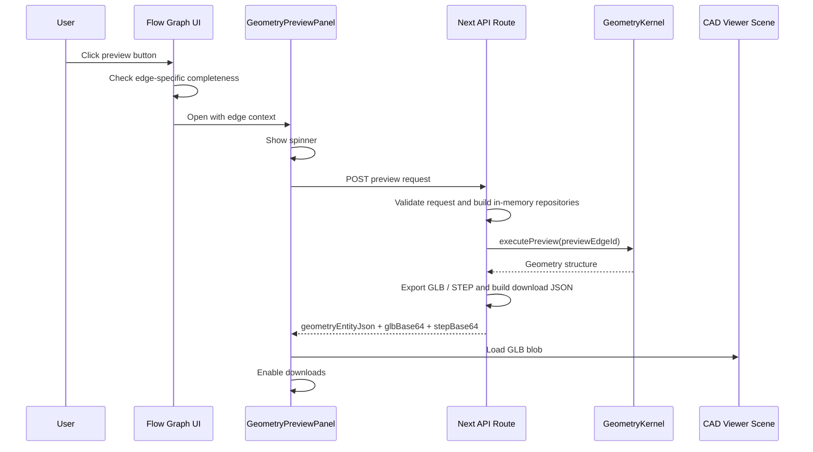

# Geometry Preview UI 設計

## 位置

Geometry Preview 不是獨立 route。它是在 `/flow-instance-editor` 的 process
flow graph 上方開啟的 overlay component。

Preview component 應該和 flow instance editor page 分離，例如：

| File | 責任 |
|---|---|
| `apps/viewer/components/geometry-preview/geometry-preview-panel.tsx` | Overlay shell、loading/error/ready 狀態、下載動作 |
| `apps/viewer/components/geometry-preview/geometry-preview-client.ts` | 呼叫 server-side preview API 的 client helper |
| `apps/viewer/app/api/geometry-preview/route.js` | Server-side kernel execution 與 GLB / STEP AP242 export |

實作時檔名可以調整，但 preview UI 必須維持為獨立 component，不應直接塞進
flow graph component 裡。

## 1. UI 設計

### 1.1 目標

Geometry Preview 讓 engineer 在建立 draft process flow instance 時，可以檢查某一條
flow edge 所代表的 geometry state。

它回答兩個問題：

- 目前進入這個 target slot 的 geometry 是什麼？
- 如果這條 edge 是由 upstream process step 產生，該 upstream step 執行 kernel
  後的 output geometry 長什麼樣？

使用者仍然留在 flow instance editor。開啟 preview 不應跳轉到 `/cad-viewer`
或任何其他頁面。

### 1.2 進入點

每一條 flow edge 都應該有 geometry preview button。

| Edge source | Button visibility | Preview result |
|---|---|---|
| `geometryRef` | 顯示在 initial geometry edge 上 | 使用者選取的 initial geometry，並經過 kernel preview execution path |
| `stepOutput` | 顯示在 process output edge 上 | Source process step 的 output geometry |

目前 graph UI 已經會在 `stepOutput` edge 顯示 preview button。實作時需要修正，
讓 `geometryRef` edge 也顯示 preview button。

### 1.3 Button Enabled State

所有 fields 在 Save flow instance 時都是 required。Preview button 的 enabled state
只檢查該 preview edge 所需的 dependency，不檢查 preview edge 後方的 downstream
steps。

對 `geometryRef` edge：

- 只有當對應 initial geometry node 已選到 `GeometryEntity.id` 時才 enabled。
- 選到的 id 必須存在於目前 geometry repository snapshot。
- 如果 initial geometry 尚未選擇、值是空的，或指到不存在的 geometry entity，
  button 必須 disabled。
- 不需要檢查 target step 或 downstream steps 的其他 required fields。Initial geometry
  preview 只代表該 selected geometry state 經過 preview execution path 的結果。

對 `stepOutput` edge：

- 只有當 source step complete 時才 enabled。
- Source step completeness 包含 source step 前面所有 upstream steps、
  upstream initial geometry selections，以及 source step 以前所有 required field values。
- Preview edge 後面的 downstream steps 不影響這顆 button。

Disabled button 仍然要顯示，讓 graph structure 保持可讀。使用 icon button 的
disabled state，並用 tooltip/title 說明阻擋原因，例如 `Complete upstream fields first`。

### 1.4 Overlay 行為

Geometry Preview 以 full-page overlay panel 的形式顯示在 graph 上方。

Layout 規則：

- 它不是新 route，也不取代目前頁面。
- 它位於 graph UI 上方。
- 背景 graph 透過 dim overlay 仍然可見。
- Preview 開啟時，背景 graph 不可互動。
- Overlay 應接近滿版，只保留一小圈 margin，讓使用者仍然感覺它是覆蓋在 graph
  上方的子頁面。
- Desktop 建議 shell size 為 `calc(100vw - 48px)` by `calc(100vh - 48px)`，
  小螢幕可以使用更小 margin。
- Panel 視覺風格應該和現有 CAD viewer 一致，維持克制、工程工具導向。

關閉行為：

- 右上角 close button。
- Escape key 關閉 preview。
- 點擊 dim background 可以關閉 preview，只要未來不和其他選取行為衝突。
- 關閉 preview 不得修改 draft instance。

### 1.5 Panel 結構

Preview panel 有四個區域：

| 區域 | 內容 |
|---|---|
| Header | Title、edge context、close button |
| Main viewport | 顯示 generated GLB 的 CAD viewer scene |
| Side controls | 重用 CAD viewer 的 section、measurement、camera、grid、axes controls |
| Footer actions | 右下角 `Save JSON`、`Save GLB` 與 `Save STEP AP242` buttons |

Header 內容：

- Title: `Geometry Preview`
- Subtitle: source label 與 target slot label，例如
  `Molding encapsulation -> main_geometry`
- Optional status badge: `Initial geometry`、`Step output`、`Loading`、`Ready`
  或 `Error`

Main viewport 應盡量重用現有 CAD viewer design 與 3D scene。Preview 不應複製一份
CAD viewer rendering logic。

### 1.6 Loading State

使用者點擊 preview button 後：

- Overlay 立即開啟。
- Server-side kernel preview 執行期間，preview panel 內顯示 spinner。
- Spinner 必須顯示在 preview panel 中，不應只顯示在 edge button 上。
- Loading 期間 download buttons disabled。
- 使用者可以在 loading 時關閉 panel。如果 request 之後才完成，不得更新已關閉的 panel。

Loading 文字應短且操作導向，例如：

```text
Generating geometry preview...
```

### 1.7 Error State

如果 validation、kernel execution 或 CAD export 失敗：

- Preview panel 保持開啟。
- 錯誤訊息顯示在 preview panel 裡。
- 不修改 graph draft。
- 不寫入 localStorage。
- `Save JSON`、`Save GLB` 與 `Save STEP AP242` disabled。
- 使用者可以關閉 panel 回到 graph。

錯誤訊息應盡量使用 server 回傳的 concise message。未來可以加 collapsible
technical detail，但第一版只需要顯示單一可讀錯誤訊息。

### 1.8 Ready State

Preview 成功後：

- Generated GLB 載入 CAD viewer scene。
- Generated geometry JSON 保存在 memory 中供下載。
- Generated STEP AP242 保存在 memory 中供下載。
- `Save JSON`、`Save GLB` 與 `Save STEP AP242` enabled。
- Graph draft 維持不變。

Viewer 應支援和 CAD viewer 相同的核心 inspection controls：

- Orbit / pan / zoom
- Camera fit
- Grid toggle
- Axes toggle
- Section plane controls
- 如果現有 CAD viewer component 已支援 measurement，則 preview 也重用 measurement controls

### 1.9 Downloads

右下角 action area 包含：

| Button | Enabled when | Output |
|---|---|---|
| `Save JSON` | Preview ready | Geometry DB import-ready JSON |
| `Save GLB` | Preview ready | Generated binary GLB |
| `Save STEP AP242` | Preview ready | Generated STEP AP242 with material labels |

Buttons 只做本機下載。它們不會把資料存入 `localStorage` 或未來 database。

建議 filename：

- JSON: `geometry-preview-{edgeId}.json`
- GLB: `geometry-preview-{edgeId}.glb`
- STEP AP242: `geometry-preview-{edgeId}.step`

若擔心檔名重複，實作可以加 timestamp。

## 2. Data 與 Kernel Execution

### 2.1 Preview Contract

Preview 是對目前 draft 的 read-only operation。

它可以讀取：

- Selected process flow template。
- Draft process step field values。
- Draft initial geometry selections。
- 目前 localStorage 中的 `GeometryEntity[]` snapshot。
- 目前 localStorage 中的 `ProcessStepTemplate[]` snapshot。

它不得寫入：

- `processFlowInstances`
- `processFlowTemplates`
- `processStepTemplates`
- `GeometryEntity`

Downloads 是 browser 本機下載，不算 database write。

### 2.2 Server-Side Execution 選擇

Preview 使用 server-side kernel execution。

這不需要額外啟動另一個 server process。同一個由 `npm run dev` 啟動的 Next.js
dev server 同時負責：

- browser UI
- `/api/geometry-preview` server-side route

因為 API route 不能直接讀 browser localStorage，所以 client 必須在 request body
中送出 preview 所需的 draft data 與 repository snapshots。

### 2.3 Kernel API 方向

Geometry kernel 端使用 dedicated preview API：

```ts
type GeometryPreviewInput = {
  processFlowTemplate: ProcessFlowTemplate;
  processFlowInstance: ProcessFlowInstance;
  previewEdgeId: string;
};

type GeometryPreviewResult = {
  geometryStructure: GeometryStructure;
  sourceKind: "geometryRef" | "stepOutput";
  outputStepRefId: string | null;
};

class GeometryKernel {
  executePreview(input: GeometryPreviewInput): Promise<GeometryPreviewResult>;
}
```

`executePreview()` 是 preview-specific API。它應該把不同 edge source 的分支邏輯
藏在 kernel/server preview path 中：

- 對 `geometryRef` edge，resolve selected geometry input，並經過 kernel preview
  path 回傳。
- 對 `stepOutput` edge，只執行必要的 upstream pre-flow，並回傳 source step output。

UI 不應自行實作 kernel semantics。UI 負責 draft validation 與 request construction；
server-side preview path 負責 execution。

### 2.4 Repository 策略

Preview 不需要把 pre-flow records 存在 localStorage 或未來 database。

Server-side repositories：

| Repository | Preview 時的資料來源 |
|---|---|
| Geometry repository | Request 中的 `GeometryEntity[]` snapshot |
| Process step repository | Request 中的 `ProcessStepTemplate[]` snapshot |
| Process flow template repository | 只包含 preview pre-flow template 的 in-memory repository |
| Process flow instance repository | 只包含 preview pre-flow instance 的 in-memory repository |

這樣可以讓 preview 和 persisted database state 隔離，同時仍然使用同一套 kernel
repository interfaces。

### 2.5 Preview Request

Client 送出的 request 類似：

```ts
type GeometryPreviewRequest = {
  previewEdgeId: string;
  flowTemplate: ProcessFlowTemplate;
  draftInstance: ProcessFlowInstance;
  geometries: GeometryEntity[];
  processStepTemplates: ProcessStepTemplate[];
};
```

`draftInstance` 不會被保存。它由目前 UI draft 依照 Save 時相同的 normalization
rules 建立：

- 每個 selected initial geometry 會成為 target field value，值為 selected
  `GeometryEntity.id`。
- 每個由 `stepOutput` 提供的 field 使用 `FieldValue.value: null`。
- 所有其他 fields 使用目前 draft field value。

### 2.6 Preview Response

Server response：

```ts
type GeometryPreviewResponse = {
  geometryEntityJson: GeometryEntityDownload;
  glbBase64: string;
  stepBase64: string;
};
```

Client 將 `glbBase64` 轉成 `Blob`，載入 CAD viewer，並使用同一個 `Blob` 供
`Save GLB` 下載。`stepBase64` 轉成 STEP `Blob`，供 `Save STEP AP242`
下載。STEP export 會把 `via`、`circuit`、`bump` 的 geometry materialize
成實體 solid，材料名稱為 `{featureType}_{material}_{density}` 的安全 token，
例如 `via_Cu_0p4`；同一個 container 內這些 feature body 的優先權高於一般 body。
當 ancestor 與 descendant container 的 body 或 materialized feature solid overlap
時，descendant solid 具有較高 priority，ancestor solid 的重疊區域會被排除。

### 2.7 Download JSON Shape

`Save JSON` 下載的是 geometry database import-ready object。

此 object 不應被視為已經 persisted。因此 `id` 是 `null`，讓未來 DB import code
可以快速辨識這個 object 尚未被分配 database identity。

```ts
type GeometryEntityDownload = {
  id: null;
  category: string | null;
  entityType: string;
  name: string;
  version: null;
  owner: null;
  description: string | null;
  structureFormat: "standard";
  structure: GeometryStructure;
};
```

預設 metadata：

| Field | Value |
|---|---|
| `id` | `null` |
| `name` | `Preview - {source label} output` |
| `version` | `null` |
| `owner` | `null` |
| `description` | 包含 edge id 與 source kind 的簡短 preview context |
| `category` | `"preview.generated"` |
| `entityType` | `"preview"` |
| `structureFormat` | `"standard"` |
| `structure` | Kernel preview output geometry structure |

重要 schema note：

- `docs/data-model.md` 的 core `GeometryEntity` schema 定義 `entityType`。
- Preview download JSON 預設加入 `entityType: "preview"`，表示這是尚未 persisted
  的 preview artifact，不代表已治理的原始 geometry 類型。

Category rule:

- Preview download JSON 的 `category` 固定為 `"preview.generated"`。
- 不沿用 input geometry category，也不從 source process step category 推導，避免
  使用者把 preview artifact 誤認為已治理的原始 geometry 或正式 process output。

### 2.8 Validation Flow

Client-side validation 決定 preview button 是否 enabled。

Server-side validation 仍然必須重新檢查 request，因為 API 接收到的是 browser
送來的 raw JSON。

Validation rules：

- `previewEdgeId` 必須存在於提供的 flow template。
- 所有 fields 都是 required。
- `geometryRef` preview edge 必須 resolve 到 selected geometry id。
- `stepOutput` preview edge 必須 resolve 到 source step。
- 該 preview edge 所需的所有 upstream steps 必須 complete。
- Referenced geometry ids 必須存在於 geometry snapshot。
- Referenced process step template ids 必須存在於 process step template snapshot。
- Pre-flow 必須 acyclic。

### 2.9 Execution Flow

```mermaid
flowchart TD
  click["User clicks edge preview button"]
  enabled{"Button enabled?"}
  open["Open GeometryPreviewPanel"]
  loading["Show spinner"]
  request["Build preview request from draft state"]
  api["POST /api/geometry-preview"]
  validate["Server validates request"]
  preflow["Build preview pre-flow template and instance"]
  kernel["GeometryKernel.executePreview"]
  export["Export preview geometry to GLB and STEP AP242"]
  response["Return geometryEntityJson, glbBase64, and stepBase64"]
  show["Load GLB into viewer and show ready state"]
  downloads["Enable Save JSON, Save GLB, and Save STEP AP242"]
  error["Show error inside preview panel"]

  click --> enabled
  enabled -- "No" --> click
  enabled -- "Yes" --> open
  open --> loading
  loading --> request
  request --> api
  api --> validate
  validate --> preflow
  preflow --> kernel
  kernel --> export
  export --> response
  response --> show
  show --> downloads

  validate -- "Invalid" --> error
  kernel -- "Execution error" --> error
  export -- "CAD export error" --> error
```

### 2.10 Sequence



### 2.11 Pre-Flow Construction

對 `geometryRef` preview edge：

- Preview source 是連到該 edge 的 selected geometry。
- `executePreview()` 透過 geometry repository resolve 該 geometry。
- 回傳的 geometry structure 仍然經過 kernel preview path，讓 UI 對所有 edge types
  都只面對同一個 execution interface。

對 `stepOutput` preview edge：

- 找到 edge source step ref id。
- 找出 source step 所需的所有 upstream process steps。
- 包含這些 upstream steps 之間的所有 flow edges。
- 包含這些 upstream steps 需要的 initial geometry edges。
- 排除 source step 後面的 downstream steps。
- 建立只包含 upstream closure 的 temporary process flow template。
- 建立只包含 included steps value sets 的 temporary process flow instance。
- 執行 temporary flow 並回傳 source step output。

Pseudocode：

```ts
async function previewEdge(edgeId: string, draft: DraftPreviewPayload) {
  const edge = findEdge(draft.flowTemplate, edgeId);

  if (edge.source.sourceType === "geometryRef") {
    return kernel.executePreview({
      processFlowTemplate: draft.flowTemplate,
      processFlowInstance: draft.draftInstance,
      previewEdgeId: edgeId,
    });
  }

  const upstreamClosure = findUpstreamClosure(
    draft.flowTemplate,
    edge.source.stepRefId,
  );
  const preFlowTemplate = buildPreFlowTemplate(draft.flowTemplate, upstreamClosure);
  const preFlowInstance = buildPreFlowInstance(
    draft.draftInstance,
    preFlowTemplate,
  );

  return kernel.executePreview({
    processFlowTemplate: preFlowTemplate,
    processFlowInstance: preFlowInstance,
    previewEdgeId: edgeId,
  });
}
```

### 2.12 UI State Model

Panel 可以使用以下 state shape：

```ts
type GeometryPreviewPanelState =
  | {
      status: "loading";
      edgeId: string;
      sourceLabel: string;
      slotLabel: string;
    }
  | {
      status: "ready";
      edgeId: string;
      sourceLabel: string;
      slotLabel: string;
      geometryEntityJson: GeometryEntityDownload;
      glbBlob: Blob;
    }
  | {
      status: "error";
      edgeId: string;
      sourceLabel: string;
      slotLabel: string;
      message: string;
    };
```

Flow instance editor 只需要保存目前開啟的 preview context。Loading、error、
GLB blob 與 download state 由 panel 自己管理。

### 2.13 Implementation Notes

- 盡量重用現有 CAD viewer scene 與 model loading utilities。
- 新增 helper，讓 viewer 可以 load generated GLB `Blob` 或 `File`，而不只支援
  使用者手動選取的 file。
- `GeometryPreviewPanel` 應和 React Flow internals 分離。只傳入 edge labels、
  request payload，以及 close/download callbacks。
- Panel 不得修改 graph nodes、graph edges 或 step field values。
- Preview output 不自動 persist。
- Server route 應針對 missing geometry、incomplete fields、kernel errors、
  CAD export errors 回傳清楚錯誤訊息。

### 2.14 First Version Non-Goals

第一版不需要：

- 將 preview output 存入 localStorage。
- 分配真正的 geometry DB id。
- 下載前提供 metadata editor。
- Body-level selection。
- 比較兩個 preview outputs。
- 跨 draft edits cache preview results。
- 執行 preview edge 後面的 downstream steps。

## 3. Product Decision

Preview download JSON 的 `category` 固定使用 `"preview.generated"`。
Preview download JSON 的 `entityType` 固定使用 `"preview"`。
